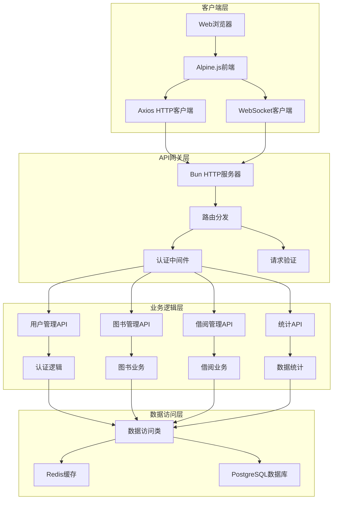
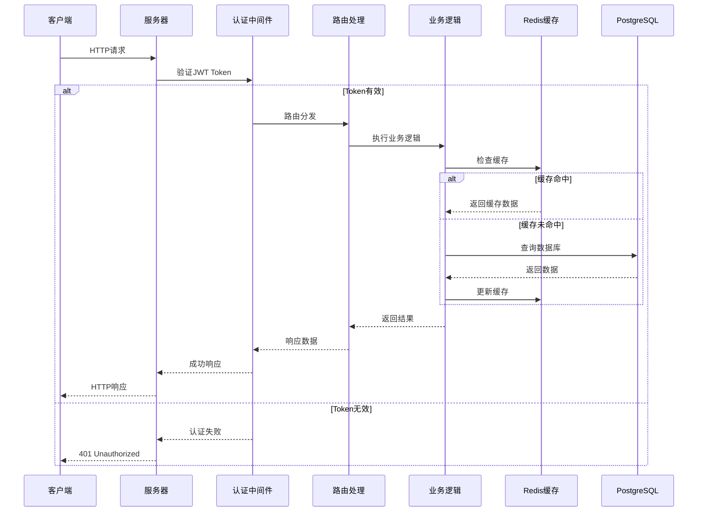
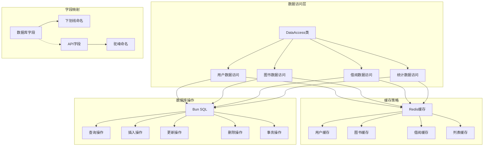
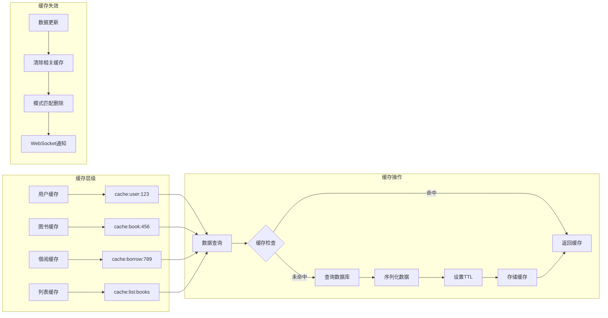
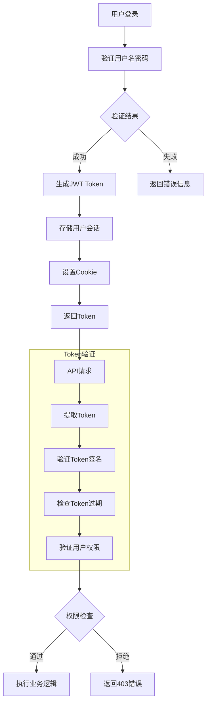
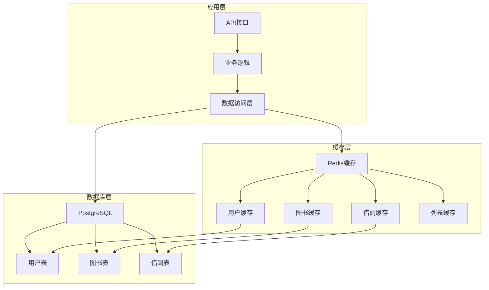
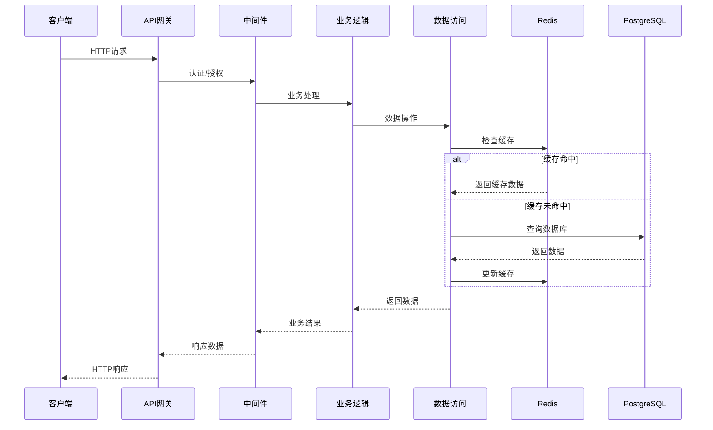
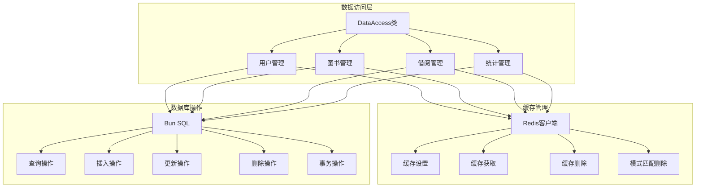
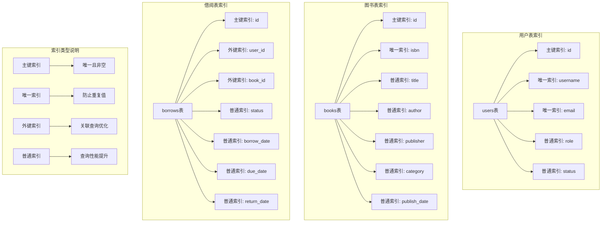
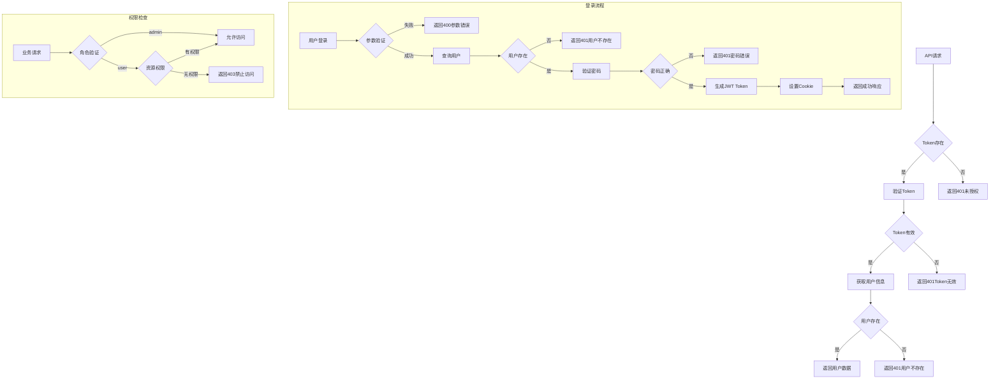

# 图书管理系统 API 文档

## 概述

图书管理系统提供完整的用户管理、图书管理、借阅管理功能，包括用户认证、图书CRUD操作、借阅管理、实时通知等。所有API都返回JSON格式的响应。系统采用 Alpine.js 3.x 作为前端框架，实现响应式数据绑定和声明式编程。

**基础URL**: `http://localhost:3000`

**认证方式**: JWT Token (通过Cookie传递)

**前端框架**: Alpine.js 3.x

**实时通信**: WebSocket

**内容类型**: `application/json`

**密码加密**: Bun.password (内置密码加密)

## 🏗️ API 架构图



## 🔄 API 请求流程图



## 🗄️ 数据访问层架构



## 📊 缓存策略图



## 🔐 认证流程架构



## 🏗️ 数据库架构

### 技术栈
- **数据库**: PostgreSQL 12+
- **缓存**: Redis 6+
- **数据库驱动**: Bun SQL (内置原生支持)
- **连接池**: 自动管理，最大连接数 10
- **事务支持**: ACID事务，支持复杂操作的原子性
- **缓存策略**: 分层缓存，智能失效，5分钟TTL

### 数据库架构图



### API请求流程图



### 数据访问层架构



### 数据表结构

#### 用户表 (users)
```sql
CREATE TABLE users (
  id SERIAL PRIMARY KEY,
  username VARCHAR(50) UNIQUE NOT NULL,
  email VARCHAR(100) UNIQUE NOT NULL,
  password VARCHAR(255) NOT NULL,
  role VARCHAR(20) NOT NULL DEFAULT 'user',
  status VARCHAR(20) NOT NULL DEFAULT 'enabled',
  created_at TIMESTAMP WITH TIME ZONE DEFAULT CURRENT_TIMESTAMP,
  updated_at TIMESTAMP WITH TIME ZONE DEFAULT CURRENT_TIMESTAMP,
  
  CONSTRAINT users_role_check CHECK (role IN ('admin', 'user')),
  CONSTRAINT users_status_check CHECK (status IN ('enabled', 'disabled'))
);

-- 索引优化
CREATE INDEX idx_users_username ON users(username);
CREATE INDEX idx_users_email ON users(email);
CREATE INDEX idx_users_role ON users(role);
CREATE INDEX idx_users_status ON users(status);
```

### 数据库索引架构图


```

#### 图书表 (books)
```sql
CREATE TABLE books (
  id SERIAL PRIMARY KEY,
  title VARCHAR(200) NOT NULL,
  author VARCHAR(100) NOT NULL,
  publisher VARCHAR(100) NOT NULL,
  isbn VARCHAR(20) UNIQUE NOT NULL,
  publish_date DATE NOT NULL,
  price DECIMAL(10,2) NOT NULL DEFAULT 0.00,
  stock INTEGER NOT NULL DEFAULT 0,
  description TEXT,
  category VARCHAR(50),
  created_at TIMESTAMP WITH TIME ZONE DEFAULT CURRENT_TIMESTAMP,
  updated_at TIMESTAMP WITH TIME ZONE DEFAULT CURRENT_TIMESTAMP,
  
  CONSTRAINT books_price_check CHECK (price >= 0),
  CONSTRAINT books_stock_check CHECK (stock >= 0)
);

-- 索引优化
CREATE INDEX idx_books_title ON books(title);
CREATE INDEX idx_books_author ON books(author);
CREATE INDEX idx_books_publisher ON books(publisher);
CREATE INDEX idx_books_isbn ON books(isbn);
CREATE INDEX idx_books_category ON books(category);
CREATE INDEX idx_books_publish_date ON books(publish_date);
```

#### 借阅记录表 (borrows)
```sql
CREATE TABLE borrows (
  id SERIAL PRIMARY KEY,
  user_id INTEGER NOT NULL REFERENCES users(id) ON DELETE CASCADE,
  book_id INTEGER NOT NULL REFERENCES books(id) ON DELETE CASCADE,
  book_title VARCHAR(200) NOT NULL,
  borrower_name VARCHAR(50) NOT NULL,
  borrow_date DATE NOT NULL,
  due_date DATE NOT NULL,
  return_date DATE,
  status VARCHAR(20) NOT NULL DEFAULT 'borrowed',
  created_at TIMESTAMP WITH TIME ZONE DEFAULT CURRENT_TIMESTAMP,
  updated_at TIMESTAMP WITH TIME ZONE DEFAULT CURRENT_TIMESTAMP,
  
  CONSTRAINT borrows_status_check CHECK (status IN ('borrowed', 'returned', 'overdue')),
  CONSTRAINT borrows_dates_check CHECK (due_date >= borrow_date),
  CONSTRAINT borrows_return_date_check CHECK (return_date IS NULL OR return_date >= borrow_date)
);

-- 索引优化
CREATE INDEX idx_borrows_user_id ON borrows(user_id);
CREATE INDEX idx_borrows_book_id ON borrows(book_id);
CREATE INDEX idx_borrows_status ON borrows(status);
CREATE INDEX idx_borrows_borrow_date ON borrows(borrow_date);
CREATE INDEX idx_borrows_due_date ON borrows(due_date);
CREATE INDEX idx_borrows_return_date ON borrows(return_date);
```

### 数据访问层特性
- **Redis缓存**: 5分钟TTL，自动缓存管理，支持模式匹配批量清除
- **字段映射**: 数据库下划线命名 ↔ 前端驼峰命名自动转换
- **分页查询**: 支持搜索、排序、分页，优化大数据集查询
- **事务支持**: 复杂操作的事务保证，确保数据一致性
- **连接池**: 自动管理数据库连接，优化性能，支持并发访问
- **错误处理**: 数据库约束错误的友好提示和自动恢复

### 缓存策略详解

#### 缓存键命名规范
```javascript
const CACHE_PREFIX = {
  USER: 'cache:user:',          // 用户缓存
  BOOK: 'cache:book:',          // 图书缓存
  BORROW: 'cache:borrow:',      // 借阅记录缓存
  LIST: 'cache:list:'           // 列表查询缓存
};
```

#### 缓存操作
- **设置缓存**: 自动序列化JSON数据，设置TTL
- **获取缓存**: 自动反序列化，异常处理
- **删除缓存**: 支持单个删除和模式匹配批量删除
- **缓存失效**: 数据更新时自动清除相关缓存

#### 缓存场景
1. **用户查询**: 缓存用户基本信息和权限
2. **图书列表**: 缓存分页查询结果和搜索结果
3. **借阅记录**: 缓存用户借阅历史和统计数据
4. **统计数据**: 缓存复杂的统计查询结果

### 字段映射说明

#### 数据库字段 → API响应字段
系统自动处理数据库字段名与API响应字段名的转换：

**通用字段**:
- `created_at` (数据库) → `createdAt` (API)
- `updated_at` (数据库) → `updatedAt` (API)
- `user_id` (数据库) → `userId` (API)
- `book_id` (数据库) → `bookId` (API)

**图书相关**:
- `publish_date` (数据库) → `publishDate` (API)

**借阅相关**:
- `book_title` (数据库) → `bookTitle` (API)
- `borrower_name` (数据库) → `borrowerName` (API)
- `borrow_date` (数据库) → `borrowDate` (API)
- `due_date` (数据库) → `dueDate` (API)
- `return_date` (数据库) → `returnDate` (API)

#### API请求字段 → 数据库字段
前端表单提交时自动转换：

```javascript
// 前端提交数据
{
  "title": "书名",
  "publishDate": "2024-01-01"
}

// 自动转换为数据库字段
{
  "title": "书名",
  "publish_date": "2024-01-01"
}
```

---

## 🔐 认证相关 API

### 认证错误处理流程图



### 1. 获取当前用户信息

**接口地址**: `GET /api/current-user`

**功能描述**: 获取当前登录用户的详细信息

**认证要求**: 需要有效的JWT Token

**请求参数**: 无

**请求示例**:
```bash
curl -X GET http://localhost:3000/api/current-user \
  -H "Cookie: token=<jwt_token>"
```

**成功响应**:
```json
{
  "success": true,
  "user": {
    "id": 1,
    "username": "admin",
    "email": "admin@example.com",
    "role": "admin",
    "status": "enabled",
    "createdAt": "2024-01-01T00:00:00.000Z"
  }
}
```

**错误响应**:
```json
{
  "success": false,
  "message": "未登录"
}
```

**状态码**:
- `200` - 成功
- `401` - 未授权访问
- `500` - 服务器错误

---

### 2. 用户登录

**接口地址**: `POST /api/login`

**功能描述**: 用户登录认证，成功后返回JWT Token

**认证要求**: 无

**请求参数**:
```json
{
  "username": "string",  // 必填，用户名
  "password": "string"   // 必填，密码
}
```

**请求示例**:
```bash
curl -X POST http://localhost:3000/api/login \
  -H "Content-Type: application/json" \
  -d '{"username": "admin", "password": "admin123"}'
```

**成功响应**:
```json
{
  "success": true,
  "message": "登录成功",
  "user": {
    "id": 1,
    "username": "admin",
    "role": "admin",
    "status": "enabled"
  }
}
```

**Set-Cookie 头部**:
```
Set-Cookie: token=<jwt_token>; Path=/; SameSite=Lax; HttpOnly
```

**错误响应**:
```json
{
  "success": false,
  "message": "用户名和密码不能为空"
}
```

```json
{
  "success": false,
  "message": "用户名或密码错误"
}
```

```json
{
  "success": false,
  "message": "用户已被禁用"
}
```

**状态码**:
- `200` - 成功
- `400` - 请求参数错误
- `401` - 用户名或密码错误
- `403` - 用户已被禁用
- `500` - 服务器错误

---

### 3. 用户注册

**接口地址**: `POST /api/register`

**功能描述**: 注册新用户账户

**认证要求**: 无

**请求参数**:
```json
{
  "username": "string",        // 必填，用户名，3-20字符，仅支持字母数字下划线
  "email": "string",           // 必填，邮箱地址，格式验证
  "password": "string",        // 必填，密码，6位以上
  "confirmPassword": "string", // 必填，确认密码，必须与密码一致
  "role": "string"            // 可选，用户角色，默认为"user"
}
```

**请求示例**:
```bash
curl -X POST http://localhost:3000/api/register \
  -H "Content-Type: application/json" \
  -d '{
    "username": "newuser",
    "email": "newuser@example.com",
    "password": "password123",
    "confirmPassword": "password123",
    "role": "user"
  }'
```

**成功响应**:
```json
{
  "success": true,
  "message": "注册成功",
  "user": {
    "id": 2,
    "username": "newuser",
    "email": "newuser@example.com",
    "role": "user",
    "status": "enabled",
    "createdAt": "2024-01-01T00:00:00.000Z"
  }
}
```

**错误响应**:
```json
{
  "success": false,
  "message": "用户名、邮箱、密码和确认密码不能为空"
}
```

```json
{
  "success": false,
  "message": "两次输入的密码不一致"
}
```

```json
{
  "success": false,
  "message": "用户名已存在"
}
```

```json
{
  "success": false,
  "message": "邮箱已被注册"
}
```

**状态码**:
- `200` - 成功
- `400` - 请求参数错误
- `409` - 用户名或邮箱已存在
- `500` - 服务器错误

---

### 4. 修改密码

**接口地址**: `POST /api/change-password`

**功能描述**: 修改用户密码

**认证要求**: 无（通过用户名和旧密码验证）

**请求参数**:
```json
{
  "username": "string",     // 必填，用户名
  "oldPassword": "string",  // 必填，旧密码
  "newPassword": "string"   // 必填，新密码，6位以上
}
```

**请求示例**:
```bash
curl -X POST http://localhost:3000/api/change-password \
  -H "Content-Type: application/json" \
  -d '{
    "username": "admin",
    "oldPassword": "oldpass123",
    "newPassword": "newpass123"
  }'
```

**成功响应**:
```json
{
  "success": true,
  "message": "密码修改成功"
}
```

**错误响应**:
```json
{
  "success": false,
  "message": "用户名、旧密码和新密码不能为空"
}
```

```json
{
  "success": false,
  "message": "用户不存在或旧密码错误"
}
```

```json
{
  "success": false,
  "message": "新密码长度至少6位"
}
```

**状态码**:
- `200` - 成功
- `400` - 请求参数错误
- `401` - 旧密码错误
- `404` - 用户不存在
- `500` - 服务器错误

---

### 5. 用户登出

**接口地址**: `POST /api/logout`

**功能描述**: 用户登出，将JWT Token加入黑名单

**认证要求**: 需要有效的JWT Token

**请求参数**: 无

**请求示例**:
```bash
curl -X POST http://localhost:3000/api/logout \
  -H "Cookie: token=<jwt_token>"
```

**成功响应**:
```json
{
  "success": true,
  "message": "登出成功"
}
```

**Set-Cookie 头部**:
```
Set-Cookie: token=; Path=/; Expires=Thu, 01 Jan 1970 00:00:00 GMT
```

**错误响应**:
```json
{
  "success": false,
  "message": "未登录"
}
```

**状态码**:
- `200` - 成功
- `401` - 未授权访问
- `500` - 服务器错误

---

## 📚 图书管理 API

### 1. 获取图书列表

**接口地址**: `GET /api/books`

**功能描述**: 获取图书列表，支持搜索和分页，集成缓存优化

**认证要求**: 需要有效的JWT Token

**查询参数**:
- `search` (可选): 搜索关键词，支持书名、作者、出版社模糊搜索
- `page` (可选): 页码，默认为1
- `pageSize` (可选): 每页数量，默认为5，最大100
- `sortBy` (可选): 排序字段，支持 title, author, publish_date, created_at
- `sortOrder` (可选): 排序方向，asc/desc，默认desc

**请求示例**:
```bash
curl -X GET "http://localhost:3000/api/books?search=小说&page=1&pageSize=10&sortBy=publish_date&sortOrder=desc" \
  -H "Cookie: token=<jwt_token>"
```

**成功响应**:
```json
{
  "success": true,
  "data": [
    {
      "id": 1,
      "title": "红楼梦",
      "author": "曹雪芹",
      "publisher": "人民文学出版社",
      "isbn": "9787020002207",
      "publishDate": "2020-01-01",
      "price": 49.80,
      "stock": 10,
      "description": "中国古典四大名著之一",
      "category": "古典文学",
      "createdAt": "2024-01-01T00:00:00.000Z",
      "updatedAt": "2024-01-01T00:00:00.000Z"
    }
  ],
  "pagination": {
    "total": 1,
    "page": 1,
    "pageSize": 10,
    "totalPages": 1
  },
  "cached": false  // 是否来自缓存
}
```

**错误响应**:
```json
{
  "success": false,
  "message": "未授权访问"
}
```

**状态码**:
- `200` - 成功
- `401` - 未授权访问
- `500` - 服务器错误

---

### 2. 创建图书

**接口地址**: `POST /api/books`

**功能描述**: 添加新图书，支持完整的字段验证

**认证要求**: 需要有效的JWT Token

**请求参数**:
```json
{
  "title": "string",       // 必填，图书标题，最大200字符
  "author": "string",      // 必填，作者，最大100字符
  "publisher": "string",   // 必填，出版社，最大100字符
  "isbn": "string",        // 必填，ISBN号，格式验证
  "publishDate": "string", // 必填，出版日期，格式: YYYY-MM-DD
  "price": "number",       // 可选，价格，默认0.00，必须>=0
  "stock": "number",       // 可选，库存，默认0，必须>=0
  "description": "string", // 可选，图书描述
  "category": "string"     // 可选，图书分类
}
```

**请求示例**:
```bash
curl -X POST http://localhost:3000/api/books \
  -H "Content-Type: application/json" \
  -H "Cookie: token=<jwt_token>" \
  -d '{
    "title": "西游记",
    "author": "吴承恩",
    "publisher": "人民文学出版社",
    "isbn": "9787020002214",
    "publishDate": "2020-01-01",
    "price": 39.80,
    "stock": 15,
    "category": "古典文学"
  }'
```

**成功响应**:
```json
{
  "success": true,
  "message": "图书添加成功",
  "data": {
    "id": 2,
    "title": "西游记",
    "author": "吴承恩",
    "publisher": "人民文学出版社",
    "isbn": "9787020002214",
    "publishDate": "2020-01-01",
    "price": 39.80,
    "stock": 15,
    "description": "中国古典四大名著之一",
    "category": "古典文学",
    "createdAt": "2024-01-01T00:00:00.000Z",
    "updatedAt": "2024-01-01T00:00:00.000Z"
  }
}
```

**错误响应**:
```json
{
  "success": false,
  "message": "所有必填字段都必须填写"
}
```

```json
{
  "success": false,
  "message": "ISBN号已存在"
}
```

```json
{
  "success": false,
  "message": "价格必须大于等于0"
}
```

**状态码**:
- `200` - 成功
- `400` - 请求参数错误
- `401` - 未授权访问
- `409` - ISBN号已存在
- `500` - 服务器错误

---

### 3. 更新图书

**接口地址**: `PUT /api/books/:id`

**功能描述**: 更新指定图书信息，支持部分字段更新

**认证要求**: 需要有效的JWT Token

**路径参数**:
- `id`: 图书ID

**请求参数**:
```json
{
  "title": "string",       // 可选，图书标题
  "author": "string",      // 可选，作者
  "publisher": "string",   // 可选，出版社
  "isbn": "string",        // 可选，ISBN号
  "publishDate": "string", // 可选，出版日期，格式: YYYY-MM-DD
  "price": "number",       // 可选，价格
  "stock": "number",       // 可选，库存
  "description": "string", // 可选，图书描述
  "category": "string"     // 可选，图书分类
}
```

**请求示例**:
```bash
curl -X PUT http://localhost:3000/api/books/1 \
  -H "Content-Type: application/json" \
  -H "Cookie: token=<jwt_token>" \
  -d '{
    "title": "红楼梦（修订版）",
    "price": 59.80,
    "stock": 20
  }'
```

**成功响应**:
```json
{
  "success": true,
  "message": "图书更新成功",
  "data": {
    "id": 1,
    "title": "红楼梦（修订版）",
    "author": "曹雪芹",
    "publisher": "人民文学出版社",
    "isbn": "9787020002207",
    "publishDate": "2020-01-01",
    "price": 59.80,
    "stock": 20,
    "description": "中国古典四大名著之一",
    "category": "古典文学",
    "createdAt": "2024-01-01T00:00:00.000Z",
    "updatedAt": "2024-01-01T12:00:00.000Z"
  }
}
```

**错误响应**:
```json
{
  "success": false,
  "message": "图书不存在"
}
```

```json
{
  "success": false,
  "message": "ISBN号已被其他图书使用"
}
```

**状态码**:
- `200` - 成功
- `400` - 请求参数错误
- `404` - 图书不存在
- `409` - ISBN号冲突
- `401` - 未授权访问
- `500` - 服务器错误

---

### 4. 删除图书

**接口地址**: `DELETE /api/books/:id`

**功能描述**: 删除指定图书，会级联删除相关借阅记录

**认证要求**: 需要有效的JWT Token

**路径参数**:
- `id`: 图书ID

**请求示例**:
```bash
curl -X DELETE http://localhost:3000/api/books/1 \
  -H "Cookie: token=<jwt_token>"
```

**成功响应**:
```json
{
  "success": true,
  "message": "图书删除成功",
  "details": {
    "deletedBookId": 1,
    "deletedBorrowsCount": 3  // 同时删除的借阅记录数
  }
}
```

**错误响应**:
```json
{
  "success": false,
  "message": "图书不存在"
}
```

```json
{
  "success": false,
  "message": "该图书有未归还的借阅记录，无法删除"
}
```

**状态码**:
- `200` - 成功
- `404` - 图书不存在
- `409` - 有未归还的借阅记录
- `401` - 未授权访问
- `500` - 服务器错误

---

## 👥 用户管理 API

### 1. 获取用户列表

**接口地址**: `GET /api/users`

**功能描述**: 获取用户列表，支持搜索和分页，管理员权限

**认证要求**: 需要有效的JWT Token（仅管理员）

**查询参数**:
- `search` (可选): 搜索关键词，支持用户名、邮箱、角色模糊搜索
- `page` (可选): 页码，默认为1
- `pageSize` (可选): 每页数量，默认为5
- `role` (可选): 角色过滤，admin/user
- `status` (可选): 状态过滤，enabled/disabled

**请求示例**:
```bash
curl -X GET "http://localhost:3000/api/users?search=admin&page=1&pageSize=10&role=admin" \
  -H "Cookie: token=<jwt_token>"
```

**成功响应**:
```json
{
  "success": true,
  "data": [
    {
      "id": 1,
      "username": "admin",
      "email": "admin@example.com",
      "role": "admin",
      "status": "enabled",
      "createdAt": "2024-01-01T00:00:00.000Z",
      "updatedAt": "2024-01-01T00:00:00.000Z"
    }
  ],
  "pagination": {
    "total": 1,
    "page": 1,
    "pageSize": 10,
    "totalPages": 1
  }
}
```

**状态码**:
- `200` - 成功
- `401` - 未授权访问
- `403` - 权限不足（非管理员）
- `500` - 服务器错误

---

### 2. 创建用户

**接口地址**: `POST /api/users`

**功能描述**: 创建新用户（管理员功能）

**认证要求**: 需要有效的JWT Token（仅管理员）

**请求参数**:
```json
{
  "username": "string",  // 必填，用户名，3-20字符
  "email": "string",     // 必填，邮箱地址
  "password": "string",  // 必填，密码，6位以上
  "role": "string",      // 必填，用户角色（admin/user）
  "status": "string"     // 必填，用户状态（enabled/disabled）
}
```

**请求示例**:
```bash
curl -X POST http://localhost:3000/api/users \
  -H "Content-Type: application/json" \
  -H "Cookie: token=<jwt_token>" \
  -d '{
    "username": "newuser",
    "email": "newuser@example.com",
    "password": "password123",
    "role": "user",
    "status": "enabled"
  }'
```

**成功响应**:
```json
{
  "success": true,
  "message": "用户创建成功",
  "data": {
    "id": 2,
    "username": "newuser",
    "email": "newuser@example.com",
    "role": "user",
    "status": "enabled",
    "createdAt": "2024-01-01T00:00:00.000Z",
    "updatedAt": "2024-01-01T00:00:00.000Z"
  }
}
```

**错误响应**:
```json
{
  "success": false,
  "message": "所有字段都必须填写"
}
```

```json
{
  "success": false,
  "message": "用户名已存在"
}
```

```json
{
  "success": false,
  "message": "邮箱已被注册"
}
```

**状态码**:
- `200` - 成功
- `400` - 请求参数错误
- `401` - 未授权访问
- `403` - 权限不足
- `409` - 用户名或邮箱已存在
- `500` - 服务器错误

---

### 3. 更新用户

**接口地址**: `PUT /api/users/:id`

**功能描述**: 更新指定用户信息（管理员功能）

**认证要求**: 需要有效的JWT Token（仅管理员）

**路径参数**:
- `id`: 用户ID

**请求参数**:
```json
{
  "email": "string",     // 可选，邮箱地址
  "password": "string",  // 可选，新密码
  "role": "string",      // 可选，用户角色
  "status": "string"     // 可选，用户状态
}
```

**请求示例**:
```bash
curl -X PUT http://localhost:3000/api/users/2 \
  -H "Content-Type: application/json" \
  -H "Cookie: token=<jwt_token>" \
  -d '{
    "role": "admin",
    "status": "enabled"
  }'
```

**成功响应**:
```json
{
  "success": true,
  "message": "用户更新成功",
  "data": {
    "id": 2,
    "username": "testuser",
    "email": "testuser@example.com",
    "role": "admin",
    "status": "enabled",
    "createdAt": "2024-01-01T00:00:00.000Z",
    "updatedAt": "2024-01-01T12:00:00.000Z"
  }
}
```

**错误响应**:
```json
{
  "success": false,
  "message": "用户不存在"
}
```

```json
{
  "success": false,
  "message": "邮箱已被其他用户使用"
}
```

**状态码**:
- `200` - 成功
- `400` - 请求参数错误
- `401` - 未授权访问
- `403` - 权限不足
- `404` - 用户不存在
- `409` - 邮箱冲突
- `500` - 服务器错误

---

### 4. 删除用户

**接口地址**: `DELETE /api/users/:id`

**功能描述**: 删除指定用户，会级联删除相关借阅记录

**认证要求**: 需要有效的JWT Token（仅管理员）

**路径参数**:
- `id`: 用户ID

**请求示例**:
```bash
curl -X DELETE http://localhost:3000/api/users/2 \
  -H "Cookie: token=<jwt_token>"
```

**成功响应**:
```json
{
  "success": true,
  "message": "用户删除成功",
  "details": {
    "deletedUserId": 2,
    "deletedBorrowsCount": 5  // 同时删除的借阅记录数
  }
}
```

**错误响应**:
```json
{
  "success": false,
  "message": "用户不存在"
}
```

```json
{
  "success": false,
  "message": "不能删除自己的账户"
}
```

**状态码**:
- `200` - 成功
- `400` - 不能删除自己
- `401` - 未授权访问
- `403` - 权限不足
- `404` - 用户不存在
- `500` - 服务器错误

---

## 📖 借阅管理 API

### 1. 获取借阅列表

**接口地址**: `GET /api/borrows`

**功能描述**: 获取借阅记录列表，支持搜索和分页，智能状态计算

**认证要求**: 需要有效的JWT Token

**查询参数**:
- `search` (可选): 搜索关键词，支持图书名、借阅者模糊搜索
- `page` (可选): 页码，默认为1
- `pageSize` (可选): 每页数量，默认为5
- `status` (可选): 状态过滤，borrowed/returned/overdue
- `userId` (可选): 用户ID过滤
- `bookId` (可选): 图书ID过滤

**请求示例**:
```bash
curl -X GET "http://localhost:3000/api/borrows?search=红楼梦&page=1&pageSize=10&status=borrowed" \
  -H "Cookie: token=<jwt_token>"
```

**成功响应**:
```json
{
  "success": true,
  "data": [
    {
      "id": 1,
      "userId": 2,
      "bookId": 1,
      "bookTitle": "红楼梦",
      "borrowerName": "张三",
      "borrowDate": "2024-01-01",
      "dueDate": "2024-01-31",
      "returnDate": null,
      "status": "borrowed",
      "computedStatus": "overdue",  // 系统计算的实际状态
      "overdueDays": 5,            // 逾期天数
      "createdAt": "2024-01-01T00:00:00.000Z",
      "updatedAt": "2024-01-01T00:00:00.000Z"
    }
  ],
  "pagination": {
    "total": 1,
    "page": 1,
    "pageSize": 10,
    "totalPages": 1
  }
}
```

**状态码**:
- `200` - 成功
- `401` - 未授权访问
- `500` - 服务器错误

---

### 2. 创建借阅记录

**接口地址**: `POST /api/borrows`

**功能描述**: 创建新的借阅记录，支持外键验证

**认证要求**: 需要有效的JWT Token

**请求参数**:
```json
{
  "userId": "number",       // 必填，用户ID，必须存在
  "bookId": "number",       // 必填，图书ID，必须存在
  "borrowDate": "string",   // 必填，借阅日期，格式: YYYY-MM-DD
  "dueDate": "string"       // 可选，到期日期，默认借阅日期+30天
}
```

**请求示例**:
```bash
curl -X POST http://localhost:3000/api/borrows \
  -H "Content-Type: application/json" \
  -H "Cookie: token=<jwt_token>" \
  -d '{
    "userId": 2,
    "bookId": 1,
    "borrowDate": "2024-01-10",
    "dueDate": "2024-02-09"
  }'
```

**成功响应**:
```json
{
  "success": true,
  "message": "借阅记录创建成功",
  "data": {
    "id": 2,
    "userId": 2,
    "bookId": 1,
    "bookTitle": "红楼梦",
    "borrowerName": "李四",
    "borrowDate": "2024-01-10",
    "dueDate": "2024-02-09",
    "returnDate": null,
    "status": "borrowed",
    "createdAt": "2024-01-10T00:00:00.000Z",
    "updatedAt": "2024-01-10T00:00:00.000Z"
  }
}
```

**错误响应**:
```json
{
  "success": false,
  "message": "用户ID和图书ID不能为空"
}
```

```json
{
  "success": false,
  "message": "指定的用户不存在"
}
```

```json
{
  "success": false,
  "message": "指定的图书不存在"
}
```

```json
{
  "success": false,
  "message": "图书库存不足"
}
```

**状态码**:
- `200` - 成功
- `400` - 请求参数错误
- `404` - 用户或图书不存在
- `409` - 库存不足
- `401` - 未授权访问
- `500` - 服务器错误

---

### 3. 更新借阅记录

**接口地址**: `PUT /api/borrows/:id`

**功能描述**: 更新指定借阅记录，支持归还操作

**认证要求**: 需要有效的JWT Token

**路径参数**:
- `id`: 借阅记录ID

**请求参数**:
```json
{
  "returnDate": "string",   // 可选，归还日期，格式: YYYY-MM-DD
  "status": "string",       // 可选，状态更新
  "dueDate": "string"       // 可选，到期日期修改
}
```

**请求示例**:
```bash
curl -X PUT http://localhost:3000/api/borrows/1 \
  -H "Content-Type: application/json" \
  -H "Cookie: token=<jwt_token>" \
  -d '{
    "returnDate": "2024-01-15",
    "status": "returned"
  }'
```

**成功响应**:
```json
{
  "success": true,
  "message": "借阅记录更新成功",
  "data": {
    "id": 1,
    "userId": 2,
    "bookId": 1,
    "bookTitle": "红楼梦",
    "borrowerName": "张三",
    "borrowDate": "2024-01-01",
    "dueDate": "2024-01-31",
    "returnDate": "2024-01-15",
    "status": "returned",
    "createdAt": "2024-01-01T00:00:00.000Z",
    "updatedAt": "2024-01-15T12:00:00.000Z"
  }
}
```

**错误响应**:
```json
{
  "success": false,
  "message": "借阅记录不存在"
}
```

```json
{
  "success": false,
  "message": "归还日期不能早于借阅日期"
}
```

**状态码**:
- `200` - 成功
- `400` - 请求参数错误
- `404` - 借阅记录不存在
- `401` - 未授权访问
- `500` - 服务器错误

---

### 4. 删除借阅记录

**接口地址**: `DELETE /api/borrows/:id`

**功能描述**: 删除指定借阅记录

**认证要求**: 需要有效的JWT Token

**路径参数**:
- `id`: 借阅记录ID

**请求示例**:
```bash
curl -X DELETE http://localhost:3000/api/borrows/1 \
  -H "Cookie: token=<jwt_token>"
```

**成功响应**:
```json
{
  "success": true,
  "message": "借阅记录删除成功"
}
```

**错误响应**:
```json
{
  "success": false,
  "message": "借阅记录不存在"
}
```

**状态码**:
- `200` - 成功
- `404` - 借阅记录不存在
- `401` - 未授权访问
- `500` - 服务器错误

---

## 📊 数据统计 API

### 1. 获取借阅统计

**接口地址**: `GET /api/statistics/borrow`

**功能描述**: 获取借阅数据统计信息，支持缓存优化

**认证要求**: 需要有效的JWT Token

**查询参数**:
- `period` (可选): 统计周期，7/30/90天，默认30天
- `refresh` (可选): 是否强制刷新缓存，true/false

**请求示例**:
```bash
curl -X GET "http://localhost:3000/api/statistics/borrow?period=30&refresh=false" \
  -H "Cookie: token=<jwt_token>"
```

**成功响应**:
```json
{
  "success": true,
  "data": {
    "total": 50,           // 总借阅记录数
    "borrowed": 30,        // 当前借阅数
    "returned": 15,        // 已归还数
    "overdue": 5,          // 逾期数
    "totalUsers": 20,      // 总用户数
    "totalBooks": 100,     // 总图书数
    "activeUsers": 15,     // 活跃用户数（有借阅记录）
    "popularBooks": [      // 热门图书Top5
      {
        "bookId": 1,
        "title": "红楼梦",
        "borrowCount": 10
      }
    ],
    "trendData": {         // 最近N天趋势数据
      "dates": ["2024-01-01", "2024-01-02", "..."],
      "borrowCounts": [3, 5, 2, 8, "..."],
      "returnCounts": [2, 3, 1, 5, "..."]
    },
    "categoryStats": [     // 分类统计
      {
        "category": "古典文学",
        "count": 15,
        "percentage": 30
      }
    ]
  },
  "cached": true,          // 是否来自缓存
  "generatedAt": "2024-01-01T12:00:00.000Z"
}
```

**状态码**:
- `200` - 成功
- `401` - 未授权访问
- `500` - 服务器错误

---

## 🛠️ 任务管理 API

### 1. 获取任务状态

**接口地址**: `GET /api/task/status`

**功能描述**: 获取后台任务状态信息

**认证要求**: 需要有效的JWT Token（仅管理员）

**请求示例**:
```bash
curl -X GET http://localhost:3000/api/task/status \
  -H "Cookie: token=<jwt_token>"
```

**成功响应**:
```json
{
  "success": true,
  "data": {
    "taskName": "借阅状态更新任务",
    "status": "running",           // running, stopped, unknown
    "lastExecuteTime": "2024-01-01T12:00:00.000Z",
    "nextExecuteTime": "2024-01-01T12:01:00.000Z",
    "interval": 60000,             // 执行间隔(毫秒)
    "isRunning": true,
    "executionCount": 1440,        // 执行次数
    "errorCount": 0,               // 错误次数
    "lastError": null              // 最后一次错误
  }
}
```

**状态码**:
- `200` - 成功
- `401` - 未授权访问
- `403` - 权限不足
- `500` - 服务器错误

---

### 2. 启动任务

**接口地址**: `POST /api/task/start`

**功能描述**: 启动后台任务

**认证要求**: 需要有效的JWT Token（仅管理员）

**请求示例**:
```bash
curl -X POST http://localhost:3000/api/task/start \
  -H "Cookie: token=<jwt_token>"
```

**成功响应**:
```json
{
  "success": true,
  "message": "任务启动成功",
  "data": {
    "taskName": "借阅状态更新任务",
    "status": "running",
    "startTime": "2024-01-01T12:00:00.000Z"
  }
}
```

**错误响应**:
```json
{
  "success": false,
  "message": "任务已在运行中"
}
```

**状态码**:
- `200` - 成功
- `400` - 任务已在运行
- `401` - 未授权访问
- `403` - 权限不足
- `500` - 服务器错误

---

### 3. 停止任务

**接口地址**: `POST /api/task/stop`

**功能描述**: 停止后台任务

**认证要求**: 需要有效的JWT Token（仅管理员）

**请求示例**:
```bash
curl -X POST http://localhost:3000/api/task/stop \
  -H "Cookie: token=<jwt_token>"
```

**成功响应**:
```json
{
  "success": true,
  "message": "任务停止成功",
  "data": {
    "taskName": "借阅状态更新任务",
    "status": "stopped",
    "stopTime": "2024-01-01T12:00:00.000Z"
  }
}
```

**错误响应**:
```json
{
  "success": false,
  "message": "任务未在运行"
}
```

**状态码**:
- `200` - 成功
- `400` - 任务未在运行
- `401` - 未授权访问
- `403` - 权限不足
- `500` - 服务器错误

---

### 4. 手动执行任务

**接口地址**: `POST /api/task/execute`

**功能描述**: 手动执行一次任务

**认证要求**: 需要有效的JWT Token（仅管理员）

**请求示例**:
```bash
curl -X POST http://localhost:3000/api/task/execute \
  -H "Cookie: token=<jwt_token>"
```

**成功响应**:
```json
{
  "success": true,
  "message": "任务执行成功",
  "data": {
    "executeTime": "2024-01-01T12:00:00.000Z",
    "result": {
      "processedRecords": 25,
      "updatedStatuses": 3,
      "errors": 0
    }
  }
}
```

**状态码**:
- `200` - 成功
- `401` - 未授权访问
- `403` - 权限不足
- `500` - 服务器错误

---

## 🔌 WebSocket 实时通信

### 1. WebSocket 连接

**连接地址**: `ws://localhost:3000/ws`

**功能描述**: 建立WebSocket连接，实现实时通信

**认证要求**: 连接后需发送认证消息

**连接示例**:
```javascript
const ws = new WebSocket('ws://localhost:3000/ws');

ws.onopen = function() {
    // 发送认证消息
    ws.send(JSON.stringify({
        type: 'auth',
        token: 'your_jwt_token'
    }));
};
```

**认证消息格式**:
```json
{
    "type": "auth",
    "token": "jwt_token_here"
}
```

---

### 2. 消息类型

#### 认证成功
```json
{
    "type": "auth_success",
    "message": "WebSocket 连接成功",
    "userId": 1,
    "username": "admin"
}
```

#### 认证失败
```json
{
    "type": "auth_error",
    "message": "身份验证失败",
    "reason": "invalid_token"
}
```

#### 系统通知
```json
{
    "type": "notification",
    "title": "系统通知",
    "message": "新的借阅记录已创建",
    "level": "info",
    "time": "2024-01-01T12:00:00.000Z",
    "data": {
        "borrowId": 123,
        "bookTitle": "红楼梦"
    }
}
```

#### 数据更新通知
```json
{
    "type": "data_update",
    "module": "books",        // books, users, borrows
    "action": "create",       // create, update, delete
    "data": {
        "id": 1,
        "title": "新图书",
        "author": "作者"
    },
    "userId": 1               // 操作用户ID
}
```

#### 任务状态更新
```json
{
    "type": "task_status_update",
    "taskName": "借阅状态更新任务",
    "status": "running",      // running, stopped, error
    "lastExecuteTime": "2024-01-01T12:00:00.000Z",
    "executionCount": 1440
}
```

#### 用户状态变更
```json
{
    "type": "user_status_change",
    "userId": 2,
    "username": "testuser",
    "newStatus": "disabled",
    "reason": "管理员操作",
    "time": "2024-01-01T12:00:00.000Z"
}
```

---

## 🚧 错误处理

### 错误响应格式

所有API错误都遵循统一的响应格式：

```json
{
    "success": false,
    "message": "错误描述信息",
    "error": "ERROR_CODE",     // 可选，错误代码
    "details": {},             // 可选，详细错误信息
    "timestamp": "2024-01-01T12:00:00.000Z"
}
```

### 常见错误码

| HTTP状态码 | 错误描述 | 解决方案 |
|-----------|---------|---------|
| `400` | 请求参数错误 | 检查请求参数格式和内容 |
| `401` | 未授权访问 | 检查JWT Token是否有效 |
| `403` | 权限不足 | 检查用户权限设置 |
| `404` | 资源不存在 | 检查资源ID是否正确 |
| `409` | 资源冲突 | 检查是否存在重复数据或约束冲突 |
| `422` | 数据验证失败 | 检查数据格式和约束条件 |
| `429` | 请求过于频繁 | 减少请求频率或稍后重试 |
| `500` | 服务器内部错误 | 联系系统管理员 |
| `503` | 服务不可用 | 检查数据库连接或稍后重试 |

### 错误示例

#### 数据库约束错误
```json
{
    "success": false,
    "message": "数据约束违反",
    "error": "CONSTRAINT_VIOLATION",
    "details": {
        "constraint": "books_isbn_key",
        "field": "isbn",
        "message": "ISBN号已存在"
    }
}
```

#### 认证错误
```json
{
    "success": false,
    "message": "Token已过期",
    "error": "TOKEN_EXPIRED",
    "details": {
        "expiredAt": "2024-01-01T12:00:00.000Z",
        "currentTime": "2024-01-01T13:00:00.000Z"
    }
}
```

#### 权限错误
```json
{
    "success": false,
    "message": "权限不足，仅管理员可执行此操作",
    "error": "PERMISSION_DENIED",
    "details": {
        "requiredRole": "admin",
        "currentRole": "user"
    }
}
```

#### 外键约束错误
```json
{
    "success": false,
    "message": "关联数据不存在",
    "error": "FOREIGN_KEY_VIOLATION",
    "details": {
        "field": "user_id",
        "value": 999,
        "referencedTable": "users"
    }
}
```

---

## 📋 请求/响应示例

### 完整的图书管理流程示例

#### 1. 登录获取Token
```bash
curl -X POST http://localhost:3000/api/login \
  -H "Content-Type: application/json" \
  -d '{"username": "admin", "password": "admin123"}' \
  -c cookies.txt
```

#### 2. 获取图书列表
```bash
curl -X GET http://localhost:3000/api/books \
  -b cookies.txt
```

#### 3. 添加图书
```bash
curl -X POST http://localhost:3000/api/books \
  -H "Content-Type: application/json" \
  -b cookies.txt \
  -d '{
    "title": "三国演义",
    "author": "罗贯中",
    "publisher": "人民文学出版社",
    "isbn": "9787020002221",
    "publishDate": "2020-03-01",
    "price": 45.00,
    "stock": 20,
    "category": "古典文学"
  }'
```

#### 4. 创建借阅记录
```bash
curl -X POST http://localhost:3000/api/borrows \
  -H "Content-Type: application/json" \
  -b cookies.txt \
  -d '{
    "userId": 2,
    "bookId": 1,
    "borrowDate": "2024-01-15"
  }'
```

#### 5. 获取统计数据
```bash
curl -X GET http://localhost:3000/api/statistics/borrow \
  -b cookies.txt
```

---

## 🔗 前端集成示例

### Alpine.js 集成示例

#### 图书管理组件
```javascript
function bookManagement() {
    return {
        books: [],
        currentPage: 1,
        pageSize: 5,
        searchTerm: '',
        isLoading: false,
        sortBy: 'created_at',
        sortOrder: 'desc',

        async init() {
            await this.loadBooks();
            this.setupWebSocket();
        },

        async loadBooks() {
            this.isLoading = true;
            try {
                const params = new URLSearchParams({
                    page: this.currentPage,
                    pageSize: this.pageSize,
                    search: this.searchTerm,
                    sortBy: this.sortBy,
                    sortOrder: this.sortOrder
                });
                
                const response = await fetch(`/api/books?${params}`);
                const data = await response.json();
                
                if (data.success) {
                    this.books = data.data;
                    this.pagination = data.pagination;
                    this.cached = data.cached;
                } else {
                    this.showError(data.message);
                }
            } catch (error) {
                this.showError('获取图书列表失败');
            } finally {
                this.isLoading = false;
            }
        },

        async createBook(bookData) {
            try {
                const response = await fetch('/api/books', {
                    method: 'POST',
                    headers: {
                        'Content-Type': 'application/json'
                    },
                    body: JSON.stringify(bookData)
                });
                
                const data = await response.json();
                
                if (data.success) {
                    this.showSuccess('图书添加成功');
                    await this.loadBooks();
                } else {
                    this.showError(data.message);
                }
            } catch (error) {
                this.showError('添加图书失败');
            }
        },

        setupWebSocket() {
            const ws = new WebSocket('ws://localhost:3000/ws');
            
            ws.onopen = () => {
                ws.send(JSON.stringify({
                    type: 'auth',
                    token: this.getToken()
                }));
            };

            ws.onmessage = (event) => {
                const data = JSON.parse(event.data);
                if (data.type === 'data_update' && data.module === 'books') {
                    this.loadBooks(); // 实时更新图书列表
                }
            };
        }
    }
}
```

#### WebSocket 集成示例
```javascript
function websocketManager() {
    return {
        ws: null,
        isConnected: false,
        notifications: [],
        reconnectAttempts: 0,
        maxReconnectAttempts: 5,

        init() {
            this.connectWebSocket();
        },

        connectWebSocket() {
            this.ws = new WebSocket('ws://localhost:3000/ws');
            
            this.ws.onopen = () => {
                this.isConnected = true;
                this.reconnectAttempts = 0;
                console.log('WebSocket连接成功');
                
                // 发送认证消息
                this.ws.send(JSON.stringify({
                    type: 'auth',
                    token: this.getToken()
                }));
            };

            this.ws.onmessage = (event) => {
                const data = JSON.parse(event.data);
                this.handleMessage(data);
            };

            this.ws.onclose = () => {
                this.isConnected = false;
                console.log('WebSocket连接断开');
                
                // 尝试重连
                if (this.reconnectAttempts < this.maxReconnectAttempts) {
                    this.reconnectAttempts++;
                    setTimeout(() => {
                        console.log(`尝试重连 ${this.reconnectAttempts}/${this.maxReconnectAttempts}`);
                        this.connectWebSocket();
                    }, 3000 * this.reconnectAttempts);
                }
            };

            this.ws.onerror = (error) => {
                console.error('WebSocket错误:', error);
            };
        },

        handleMessage(data) {
            switch (data.type) {
                case 'auth_success':
                    console.log('WebSocket认证成功');
                    break;
                case 'auth_error':
                    console.error('WebSocket认证失败:', data.message);
                    break;
                case 'notification':
                    this.addNotification(data);
                    break;
                case 'data_update':
                    this.handleDataUpdate(data);
                    break;
                case 'task_status_update':
                    this.updateTaskStatus(data);
                    break;
            }
        },

        addNotification(notification) {
            this.notifications.unshift({
                ...notification,
                id: Date.now(),
                time: new Date().toLocaleTimeString()
            });
            
            // 只保留最近20条通知
            if (this.notifications.length > 20) {
                this.notifications = this.notifications.slice(0, 20);
            }
            
            // 显示浏览器通知
            if (Notification.permission === 'granted') {
                new Notification(notification.title, {
                    body: notification.message,
                    icon: '/favicon.ico'
                });
            }
        }
    }
}
```

---

## 🔧 开发和调试

### API 测试工具

#### 1. 使用 curl 测试
```bash
# 设置基础URL
BASE_URL="http://localhost:3000"

# 登录并保存Cookie
curl -X POST "$BASE_URL/api/login" \
  -H "Content-Type: application/json" \
  -d '{"username": "admin", "password": "admin123"}' \
  -c cookies.txt

# 使用Cookie访问其他API
curl -X GET "$BASE_URL/api/books" \
  -b cookies.txt

# 测试带参数的请求
curl -X GET "$BASE_URL/api/books?search=红楼梦&page=1&pageSize=5" \
  -b cookies.txt
```

#### 2. 使用 Postman 测试
1. 创建新的Collection: "图书管理系统API"
2. 设置环境变量: `baseUrl = http://localhost:3000`
3. 创建登录请求并设置Tests脚本自动保存Token
4. 其他请求使用 `{{token}}` 变量

#### 3. 使用 JavaScript 测试
```javascript
// API测试脚本
class ApiTester {
    constructor(baseUrl = 'http://localhost:3000') {
        this.baseUrl = baseUrl;
        this.token = null;
    }

    async login(username, password) {
        const response = await fetch(`${this.baseUrl}/api/login`, {
            method: 'POST',
            headers: { 'Content-Type': 'application/json' },
            body: JSON.stringify({ username, password })
        });
        
        if (response.ok) {
            // 从Set-Cookie头部提取token
            const setCookie = response.headers.get('set-cookie');
            if (setCookie) {
                this.token = setCookie.split('token=')[1].split(';')[0];
            }
        }
        
        return response.json();
    }

    async get(endpoint, params = {}) {
        const url = new URL(`${this.baseUrl}${endpoint}`);
        Object.keys(params).forEach(key => 
            url.searchParams.append(key, params[key])
        );
        
        return fetch(url.toString(), {
            headers: { 'Cookie': `token=${this.token}` }
        }).then(res => res.json());
    }

    async post(endpoint, data) {
        return fetch(`${this.baseUrl}${endpoint}`, {
            method: 'POST',
            headers: {
                'Content-Type': 'application/json',
                'Cookie': `token=${this.token}`
            },
            body: JSON.stringify(data)
        }).then(res => res.json());
    }

    async put(endpoint, data) {
        return fetch(`${this.baseUrl}${endpoint}`, {
            method: 'PUT',
            headers: {
                'Content-Type': 'application/json',
                'Cookie': `token=${this.token}`
            },
            body: JSON.stringify(data)
        }).then(res => res.json());
    }

    async delete(endpoint) {
        return fetch(`${this.baseUrl}${endpoint}`, {
            method: 'DELETE',
            headers: { 'Cookie': `token=${this.token}` }
        }).then(res => res.json());
    }
}

// 使用示例
const api = new ApiTester();
await api.login('admin', 'admin123');
const books = await api.get('/api/books', { search: '红楼梦', page: 1 });
console.log(books);
```

### 调试技巧

#### 1. 日志记录
服务器会在控制台输出详细的请求日志：
```
[2024-01-01T12:00:00.000Z] POST /api/login - 200 (50ms) - Cache: MISS
[2024-01-01T12:00:01.000Z] GET /api/books - 200 (25ms) - Cache: HIT
[2024-01-01T12:00:02.000Z] WebSocket 连接已建立 - User: admin
```

#### 2. 错误追踪
- 检查浏览器开发者工具的Network标签
- 查看Console中的错误信息  
- 检查服务器控制台输出
- 查看PostgreSQL日志: `tail -f /var/log/postgresql/postgresql-*.log`
- 监控Redis: `redis-cli monitor`

#### 3. Token 验证
```javascript
// 在浏览器控制台中验证token
function parseJWT(token) {
    const base64Url = token.split('.')[1];
    const base64 = base64Url.replace(/-/g, '+').replace(/_/g, '/');
    const jsonPayload = decodeURIComponent(atob(base64).split('').map(function(c) {
        return '%' + ('00' + c.charCodeAt(0).toString(16)).slice(-2);
    }).join(''));
    return JSON.parse(jsonPayload);
}

// 使用方法
const token = document.cookie.split('token=')[1].split(';')[0];
console.log(parseJWT(token));
```

#### 4. 数据库调试
```sql
-- 查看活跃连接
SELECT * FROM pg_stat_activity WHERE state = 'active';

-- 查看表大小
SELECT 
    schemaname,
    tablename,
    attname,
    n_distinct,
    correlation
FROM pg_stats
WHERE tablename IN ('users', 'books', 'borrows');

-- 查看索引使用情况
SELECT 
    t.tablename,
    indexname,
    c.reltuples AS num_rows,
    pg_size_pretty(pg_relation_size(quote_ident(t.tablename)::text)) AS table_size,
    pg_size_pretty(pg_relation_size(quote_ident(indexrelname)::text)) AS index_size
FROM pg_tables t
LEFT OUTER JOIN pg_class c ON c.relname=t.tablename
LEFT OUTER JOIN pg_indexes i ON i.tablename=t.tablename
WHERE t.schemaname='public';
```

#### 5. 缓存调试
```bash
# 连接Redis查看缓存
redis-cli

# 查看所有缓存键
KEYS cache:*

# 查看特定缓存
GET cache:book:list:page:1:size:5:search:

# 查看缓存过期时间
TTL cache:user:1

# 清除所有缓存
FLUSHALL

# 查看Redis状态
INFO memory
INFO stats
```

---

## 📖 版本历史

### v1.0.0 (当前版本)
- ✅ 完整的用户认证API，支持JWT和cookie认证
- ✅ 图书管理CRUD API，支持完整的字段验证
- ✅ 用户管理API，支持角色和状态管理
- ✅ 借阅管理API，支持外键约束和状态计算
- ✅ 数据统计API，支持多维度统计分析
- ✅ 任务管理API，支持后台任务控制
- ✅ WebSocket实时通信，支持多种消息类型
- ✅ PostgreSQL数据库支持，ACID事务保证
- ✅ Redis缓存机制，智能缓存失效
- ✅ 字段自动映射，数据库与API字段转换
- ✅ 完善的错误处理机制
- ✅ 外键约束和数据完整性检查
- ✅ 分页、搜索、排序功能
- ✅ Bun SQL原生驱动，高性能数据库操作

### 未来版本规划

#### v1.1.0
- 📋 批量操作API（批量导入/导出/删除）
- 📋 高级搜索API（多条件组合搜索）
- 📋 文件上传API（图书封面、用户头像）
- 📋 数据导出API（Excel、PDF格式）
- 📋 邮件通知API（逾期提醒、密码重置）

#### v1.2.0
- 📋 细粒度权限管理API
- 📋 操作日志记录API
- 📋 系统配置管理API
- 📋 通知模板管理API
- 📋 多租户支持API

#### v1.3.0
- 📋 国际化支持API
- 📋 数据备份/恢复API
- 📋 性能监控API
- 📋 审计日志API
- 📋 API版本控制

---

## 📞 技术支持

### 常见问题

#### Q: 如何处理Token过期？
A: 当接收到401状态码且错误类型为TOKEN_EXPIRED时，重新调用登录API获取新Token。前端可以实现自动刷新机制。

#### Q: WebSocket连接失败怎么办？
A: 检查服务器是否运行，Token是否有效，网络连接是否正常。实现重连机制和降级方案。

#### Q: 如何处理数据库约束错误？
A: 系统会返回详细的约束错误信息，前端应根据错误类型提供用户友好的提示。

#### Q: 缓存什么时候会失效？
A: 缓存在以下情况会失效：1) TTL过期（5分钟）2) 相关数据更新时主动清除 3) 手动清除

#### Q: 如何实现文件上传？
A: 当前版本不支持文件上传，计划在v1.1.0版本中添加。可以使用第三方存储服务作为临时方案。

#### Q: 是否支持批量操作？
A: 当前版本不支持批量操作，计划在v1.1.0版本中添加。可以通过循环调用单个API实现。

#### Q: 如何监控API性能？
A: 系统提供基本的响应时间日志，推荐使用APM工具进行深度监控。

#### Q: 数据库连接池如何配置？
A: 在`back-js/database.js`中修改DB_CONFIG的max、idleTimeout等参数。

### 联系方式

- **文档更新**: 查看项目README.md和UI.md
- **错误报告**: 创建GitHub Issue
- **功能请求**: 提交Pull Request

---

**最后更新**: 2024年12月

**API版本**: v1.0.0

**文档版本**: v1.0.0 