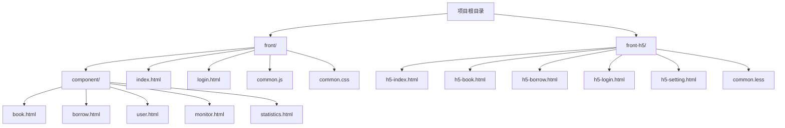
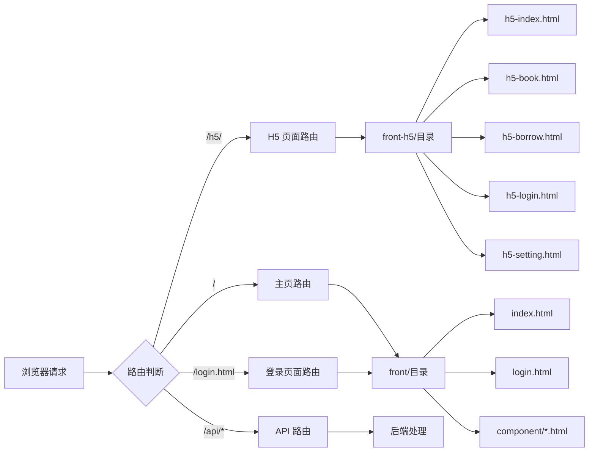

# H5 路由修复说明

## 问题描述

H5 页面已经从 `front/h5/` 目录移动到项目根目录的 `front-h5/` 目录，但是路由配置没有相应更新，导致访问 H5 页面时出现 `ENOENT: no such file or directory` 错误。

## 修复内容

### 1. 路由配置更新

在 `back-js/routes.js` 中添加了专门的 H5 HTML 文件路由处理：

```javascript
// 处理 H5 HTML 文件路由
if (url.pathname.startsWith("/h5/") && url.pathname.endsWith('.html')) {
  const htmlFile = url.pathname.substring(5); // 移除开头的 "/h5/"
  return await handleHtmlCache(req, `front-h5/${htmlFile}`);
}
```

### 2. 目录结构对比



### 3. 路由映射关系



### 4. 文件访问路径

| 浏览器请求路径 | 实际文件路径 | 说明 |
|---------------|-------------|------|
| `/h5/h5-index.html` | `front-h5/h5-index.html` | H5 主页 |
| `/h5/h5-book.html` | `front-h5/h5-book.html` | H5 图书页面 |
| `/h5/h5-borrow.html` | `front-h5/h5-borrow.html` | H5 借阅页面 |
| `/h5/h5-login.html` | `front-h5/h5-login.html` | H5 登录页面 |
| `/h5/h5-setting.html` | `front-h5/h5-setting.html` | H5 设置页面 |
| `/h5/common.less` | `front-h5/common.less` | H5 样式文件 |

## 测试验证

### 1. 命令行测试

```bash
# 测试 H5 主页
curl -k https://localhost:3000/h5/h5-index.html

# 测试 H5 图书页面
curl -k https://localhost:3000/h5/h5-book.html

# 测试 H5 登录页面
curl -k https://localhost:3000/h5/h5-login.html
```

### 2. 浏览器访问

- **H5 主页**: https://localhost:3000/h5/h5-index.html
- **H5 图书**: https://localhost:3000/h5/h5-book.html
- **H5 借阅**: https://localhost:3000/h5/h5-borrow.html
- **H5 登录**: https://localhost:3000/h5/h5-login.html
- **H5 设置**: https://localhost:3000/h5/h5-setting.html

## 修复效果

✅ **问题已解决**

- H5 页面可以正常访问
- 路由映射正确
- 静态资源加载正常
- HTTPS 支持完整

## 注意事项

1. **目录结构**: H5 页面统一放在 `front-h5/` 目录下
2. **路由前缀**: 所有 H5 页面都以 `/h5/` 开头
3. **资源文件**: H5 的样式文件使用 `.less` 格式
4. **HTTPS**: 所有页面都支持 HTTPS 访问 