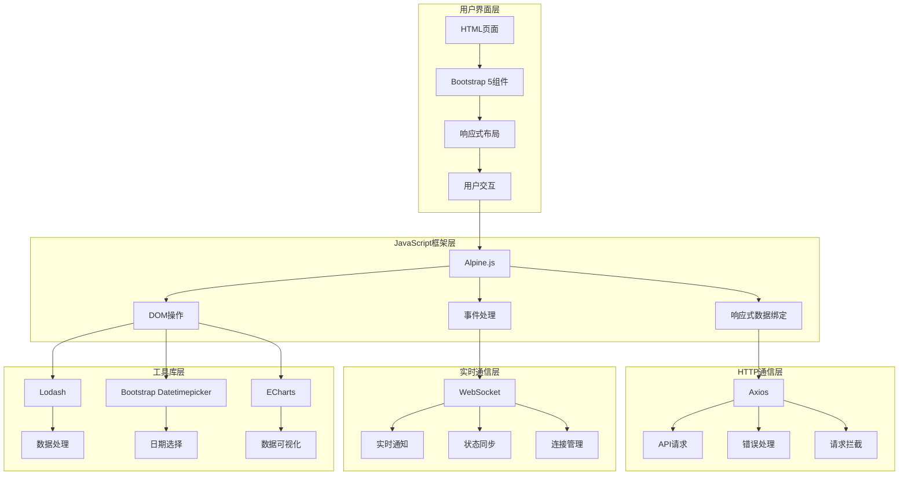
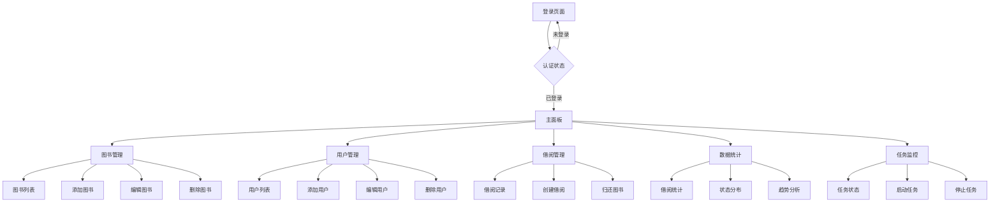
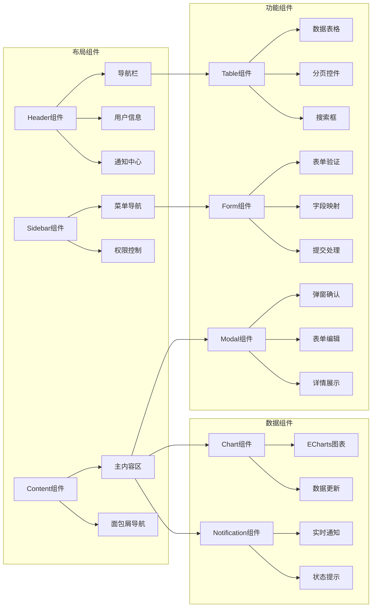
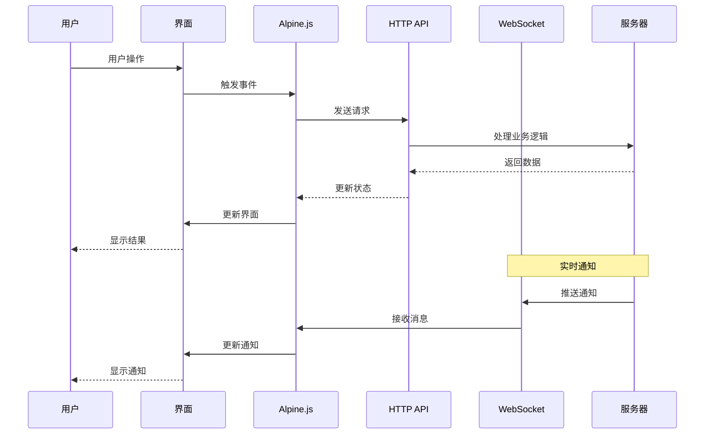
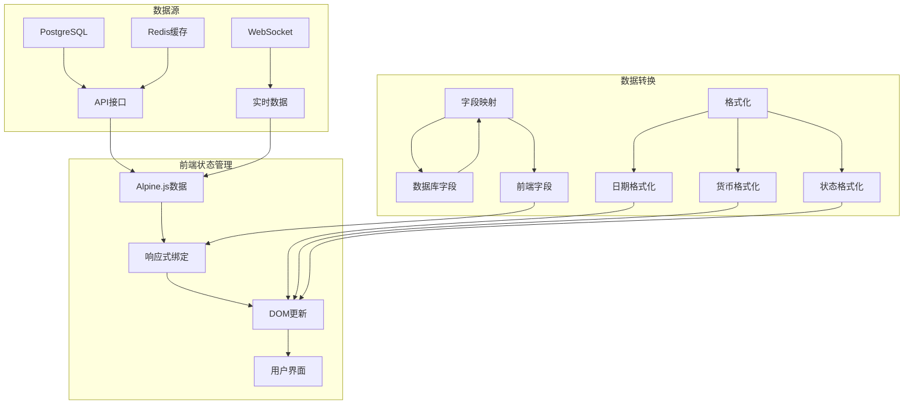
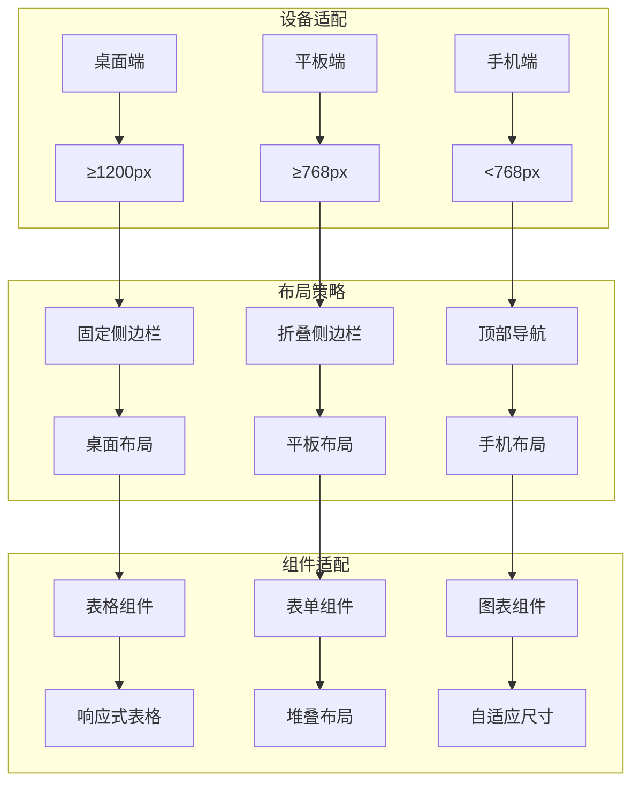
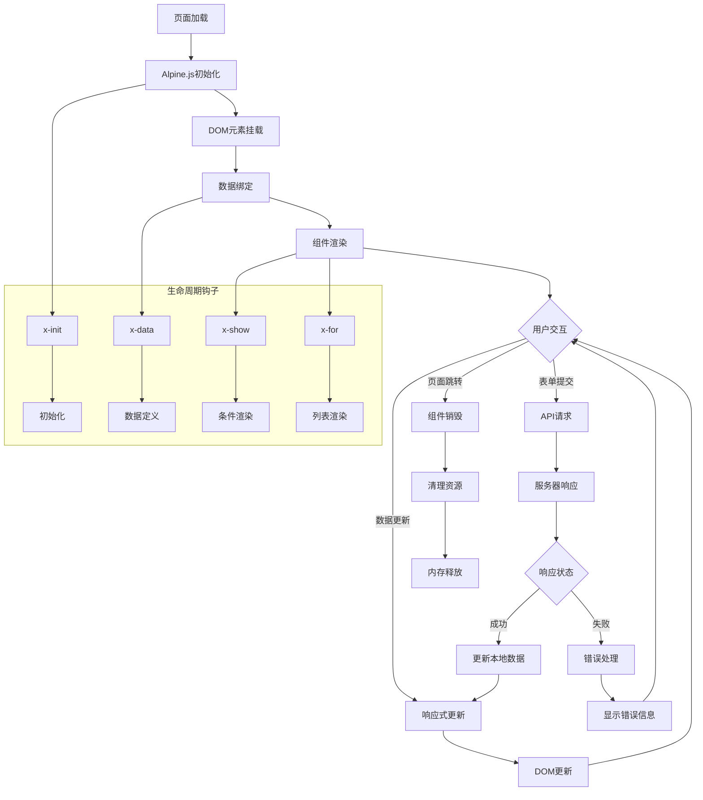
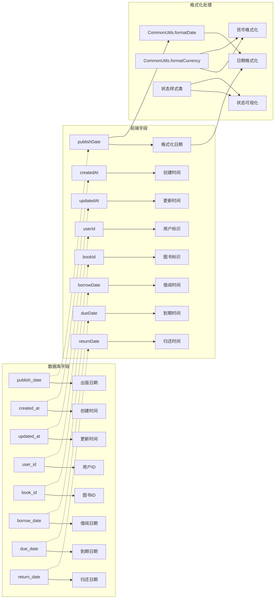
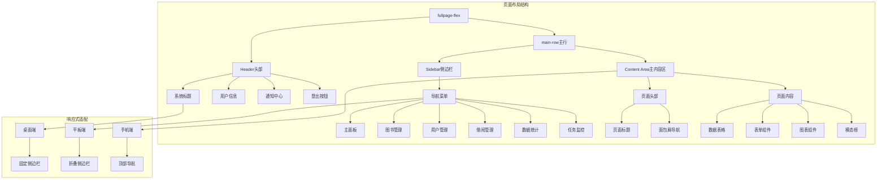

# 图书管理系统 UI 设计文档

## 概述

图书管理系统采用现代化的响应式设计，使用 Bootstrap 5 框架和 Alpine.js 3.x 构建，提供直观易用的用户界面。系统采用声明式编程范式，实现响应式数据绑定和流畅的用户交互体验。集成 WebSocket 实时通知功能，提供更好的用户体验和实时协作功能。

**设计风格**: 简洁现代、响应式布局、用户友好、声明式交互、实时通知

**技术栈**: HTML5 + CSS3 + JavaScript + Bootstrap 5.3.2 + Alpine.js 3.x + WebSocket + Bun SQL + PostgreSQL + Redis

**设计理念**: 渐进式增强、响应式优先、无障碍访问、实时反馈、用户体验至上

**最新改进**:
- ✅ **数据库升级**: 从内存存储升级到 PostgreSQL + Redis 架构
- ✅ **性能优化**: 采用 Bun 内置 SQL 驱动，提升数据库操作性能
- ✅ **字段映射**: 完善了数据库字段与前端字段的自动映射
- ✅ **日期显示**: 修复了图书出版日期在表格中的显示问题
- ✅ **错误处理**: 改进了数据库约束错误的处理和用户反馈
- ✅ **缓存机制**: 集成 Redis 缓存，提升数据查询效率
- ✅ **实时功能**: 增强了 WebSocket 实时通信和状态同步
- ✅ **表单验证**: 完善了前后端数据验证和约束检查
- ✅ **用户体验**: 改进了加载状态、错误提示和操作反馈

**浏览器支持**: Chrome 80+, Firefox 75+, Safari 13+, Edge 80+

## 🏗️ 前端架构图



## 📱 页面导航架构



## 🎨 组件关系图



## 🔄 用户交互流程图



## 📊 数据绑定架构



## 🎯 响应式设计架构



## 🔄 组件生命周期图



## 🔗 数据字段映射

### 字段映射关系图



### 后端数据库字段 → 前端显示
系统在数据传输过程中处理了数据库下划线命名与前端命名的映射：

**图书数据字段**:
- `publish_date` (数据库) → 通过 `CommonUtils.formatDate()` 格式化显示
- `created_at` (数据库) → `createdAt` (前端，部分接口)
- `updated_at` (数据库) → `updatedAt` (前端，部分接口)
- `isbn` (数据库) → 在表格中直接显示
- `price` (数据库) → 在表格中显示为货币格式
- `stock` (数据库) → 在表格中显示库存数量
- `category` (数据库) → 在表格中显示分类标签

**借阅记录字段**:
- `user_id` (数据库) → `userId` (前端)
- `book_id` (数据库) → `bookId` (前端)
- `book_title` (数据库) → `bookTitle` (前端)
- `borrower_name` (数据库) → `borrowerName` (前端)
- `borrow_date` (数据库) → `borrowDate` (前端)
- `due_date` (数据库) → `dueDate` (前端)
- `return_date` (数据库) → `returnDate` (前端)

**用户数据字段**:
- `email` (数据库) → 在用户管理界面显示
- `role` (数据库) → 通过徽章样式显示角色
- `status` (数据库) → 通过状态按钮显示启用/禁用

**注意事项**:
- 日期字段统一使用 `CommonUtils.formatDate()` 进行格式化
- 数据库时间戳字段保持 ISO 8601 格式传输
- 前端表单提交时自动转换为数据库期望的字段名
- 货币字段使用 `CommonUtils.formatCurrency()` 格式化
- 状态字段通过条件样式类实现可视化

---

## 🎨 整体设计系统

### 色彩系统

**主色调**:
- 渐变背景：`linear-gradient(135deg, #667eea 0%, #764ba2 100%)`
- 主要蓝色：`#667eea`
- 主要紫色：`#764ba2`

**功能色彩**:
- 成功色：`#28a745` (Bootstrap success)
- 警告色：`#ffc107` (Bootstrap warning)  
- 错误色：`#dc3545` (Bootstrap danger)
- 信息色：`#17a2b8` (Bootstrap info)

**状态色彩**:
- 正常借阅：`#28a745` (绿色)
- 逾期借阅：`#dc3545` (红色)
- 已归还：`#6c757d` (灰色)
- 管理员角色：`#dc3545` (红色徽章)
- 普通用户：`#007bff` (蓝色徽章)

**背景和表面**:
- 卡片背景：`rgba(255, 255, 255, 0.95)` (半透明白色)
- 毛玻璃效果：`backdrop-filter: blur(10px)`
- 阴影：`box-shadow: 0 4px 20px rgba(0, 0, 0, 0.1)`

### 字体系统

**字体族**:
```css
font-family: 'Segoe UI', Tahoma, Geneva, Verdana, sans-serif
```

**字体大小层级**:
- 大标题：`2.5rem` (40px)
- 标题：`1.75rem` (28px)
- 副标题：`1.25rem` (20px)
- 正文：`1rem` (16px)
- 小字：`0.875rem` (14px)

### 布局系统

**响应式断点** (Bootstrap 5):
- `xs`: < 576px (手机)
- `sm`: ≥ 576px (大手机)
- `md`: ≥ 768px (平板)
- `lg`: ≥ 992px (桌面)
- `xl`: ≥ 1200px (大桌面)
- `xxl`: ≥ 1400px (超大桌面)

**间距系统** (Bootstrap spacing):
- `p-0` 到 `p-5`: padding (0, 0.25rem, 0.5rem, 1rem, 1.5rem, 3rem)
- `m-0` 到 `m-5`: margin (0, 0.25rem, 0.5rem, 1rem, 1.5rem, 3rem)

### 组件规范

**按钮样式**:
- 主要按钮：`btn btn-primary`
- 次要按钮：`btn btn-secondary`
- 成功按钮：`btn btn-success`
- 危险按钮：`btn btn-danger`
- 大小变体：`btn-sm`, `btn-lg`

**卡片组件**:
```css
.card {
    background: rgba(255, 255, 255, 0.95);
    backdrop-filter: blur(10px);
    border: none;
    border-radius: 15px;
    box-shadow: 0 4px 20px rgba(0, 0, 0, 0.1);
}
```

---

## 📱 页面结构设计

### 页面布局架构图



### 整体布局架构

所有页面采用统一的全屏布局结构：

```html
<div class="fullpage-flex">
    <header class="header">
        <!-- 页面头部 -->
    </header>
    <div class="main-row">
        <nav class="sidebar">
            <!-- 侧边导航 -->
        </nav>
        <main class="content-area">
            <!-- 主内容区 -->
        </main>
    </div>
</div>
```

**布局特点**:
- **全屏设计**: `100vh` 高度，无滚动条的沉浸式体验
- **弹性布局**: Flexbox 实现自适应布局
- **固定头部**: 头部固定在顶部，提供一致的导航体验
- **响应式侧边栏**: 在移动设备上可折叠

### 头部设计 (Header)

**结构组成**:
- 系统标题
- 用户信息显示
- 通知中心
- 登出按钮

**样式特点**:
```css
.header {
    background: rgba(255, 255, 255, 0.95);
    backdrop-filter: blur(10px);
    border-bottom: 1px solid rgba(255, 255, 255, 0.2);
    box-shadow: 0 4px 20px rgba(0, 0, 0, 0.1);
    height: 80px;
}
```

**功能组件**:
- **实时通知**: WebSocket 驱动的通知徽章
- **用户头像**: 显示当前用户身份
- **快捷操作**: 常用功能快速入口

### 侧边导航 (Sidebar)

**导航菜单结构**:
1. 📊 主面板 (index.html)
2. 📚 图书管理 (book.html)

4. 📖 借阅管理 (borrow.html)


**设计特点**:
- **视觉层次**: 清晰的图标和文字组合
- **活跃状态**: 当前页面高亮显示
- **悬停效果**: 优雅的悬停反馈
- **响应式**: 移动端可收缩为图标模式

**样式实现**:
```css
.sidebar {
    background: rgba(255, 255, 255, 0.9);
    backdrop-filter: blur(15px);
    width: 250px;
    transition: all 0.3s ease;
}

.nav-item.active {
    background: linear-gradient(135deg, #667eea 0%, #764ba2 100%);
    color: white;
}
```

### 主内容区 (Content Area)

**布局原则**:
- **卡片化设计**: 内容分组在不同卡片中
- **网格系统**: 使用 Bootstrap Grid 实现响应式布局
- **滚动优化**: 内容区域独立滚动，保持头部和侧边栏固定

**内容结构**:
```html
<main class="content-area">
    <div class="content-wrapper">
        <div class="page-header">
            <!-- 页面标题和面包屑 -->
        </div>
        <div class="page-content">
            <!-- 具体页面内容 -->
        </div>
    </div>
</main>
```

---

## 🏠 页面详细设计

### 1. 登录页面 (login.html)

**设计亮点**:
- **多功能集成**: 登录、注册、修改密码三合一界面
- **平滑切换**: Alpine.js 实现的平滑表单切换动画
- **表单验证**: 实时验证用户输入
- **记住密码**: 本地存储用户凭据选项

**界面组件**:

#### 登录表单
```html
<div x-show="currentForm === 'login'" x-transition>
    <form class="needs-validation">
        <div class="mb-3">
            <label for="username" class="form-label">用户名</label>
            <input type="text" class="form-control" id="username" required>
        </div>
        <div class="mb-3">
            <label for="password" class="form-label">密码</label>
            <input type="password" class="form-control" id="password" required>
        </div>
        <button type="submit" class="btn btn-primary w-100">登录</button>
    </form>
</div>
```

#### 注册表单增强
```html
<div x-show="currentForm === 'register'" x-transition>
    <form class="needs-validation">
        <div class="mb-3">
            <label for="regUsername" class="form-label">用户名</label>
            <input type="text" class="form-control" id="regUsername" required>
            <div class="form-text">3-20字符，仅支持字母数字下划线</div>
        </div>
        <div class="mb-3">
            <label for="regEmail" class="form-label">邮箱地址</label>
            <input type="email" class="form-control" id="regEmail" required>
        </div>
        <div class="mb-3">
            <label for="regPassword" class="form-label">密码</label>
            <input type="password" class="form-control" id="regPassword" required>
            <div class="form-text">密码长度至少6位</div>
        </div>
        <div class="mb-3">
            <label for="confirmPassword" class="form-label">确认密码</label>
            <input type="password" class="form-control" id="confirmPassword" required>
        </div>
        <button type="submit" class="btn btn-primary w-100">注册</button>
    </form>
</div>
```

#### 表单切换导航
```html
<ul class="nav nav-tabs mb-4">
    <li class="nav-item">
        <a class="nav-link" :class="{'active': currentForm === 'login'}" 
           @click="currentForm = 'login'">登录</a>
    </li>
    <li class="nav-item">
        <a class="nav-link" :class="{'active': currentForm === 'register'}" 
           @click="currentForm = 'register'">注册</a>
    </li>
    <li class="nav-item">
        <a class="nav-link" :class="{'active': currentForm === 'changePassword'}" 
           @click="currentForm = 'changePassword'">修改密码</a>
    </li>
</ul>
```

**状态管理**:
- `currentForm`: 当前显示的表单类型
- `isLoading`: 提交状态
- `errorMessage`: 错误信息显示
- `rememberMe`: 记住密码选项

### 2. 主页面 (index.html)

**功能概览**:
- **快速统计**: 关键数据指标展示
- **最近活动**: 最新借阅记录预览
- **快捷操作**: 常用功能快速入口
- **系统通知**: 重要消息和提醒

**仪表板布局**:
```html
<div class="row">
    <div class="col-md-3">
        <div class="stats-card">
            <div class="stats-icon">📚</div>
            <h3>图书总数</h3>
            <span class="stats-number" x-text="stats.totalBooks">0</span>
        </div>
    </div>
    <div class="col-md-3">
        <div class="stats-card">
            <div class="stats-icon">👥</div>
            <h3>用户总数</h3>
            <span class="stats-number" x-text="stats.totalUsers">0</span>
        </div>
    </div>
    <div class="col-md-3">
        <div class="stats-card">
            <div class="stats-icon">📖</div>
            <h3>当前借阅</h3>
            <span class="stats-number" x-text="stats.activeBorrows">0</span>
        </div>
    </div>
    <div class="col-md-3">
        <div class="stats-card">
            <div class="stats-icon">⚠️</div>
            <h3>逾期记录</h3>
            <span class="stats-number text-danger" x-text="stats.overdueBorrows">0</span>
        </div>
    </div>
</div>
```

**数据绑定**:
```javascript
Alpine.data('dashboardData', () => ({
    stats: {
        totalBooks: 0,
        totalUsers: 0,
        activeBorrows: 0,
        overdueBorrows: 0
    },
    recentActivities: [],
    
    async init() {
        await this.loadStats();
        await this.loadRecentActivities();
        this.setupAutoRefresh();
    },
    
    setupAutoRefresh() {
        setInterval(() => {
            this.loadStats();
            this.loadRecentActivities();
        }, 30000); // 30秒自动刷新
    }
}))
```

### 3. 图书管理页面 (book.html)

**核心功能**:
- **图书列表**: 分页展示图书信息，支持出版日期正确显示
- **搜索过滤**: 支持书名、作者、出版社搜索
- **添加图书**: 模态框形式的图书添加，支持日期选择器
- **编辑图书**: 内联编辑或模态框编辑，支持字段验证
- **删除图书**: 带确认的删除操作
- **数据映射**: 自动处理数据库字段名与前端显示的转换

**最新修复**:
- ✅ **出版日期显示**: 修复了表格中出版日期不显示的问题
- ✅ **字段映射**: 正确处理 `publish_date` 数据库字段的显示
- ✅ **日期格式化**: 使用 `CommonUtils.formatDate()` 统一日期格式
- ✅ **表单验证**: 改进了图书编辑表单的数据验证
- ✅ **ISBN验证**: 添加了ISBN号的唯一性检查
- ✅ **价格显示**: 添加了价格字段的货币格式化
- ✅ **库存管理**: 集成了库存数量的显示和管理

**列表设计**:
```html
<div class="table-responsive">
    <table class="table table-hover">
        <thead>
            <tr>
                <th>ID</th>
                <th>书名</th>
                <th>作者</th>
                <th>出版社</th>
                <th>ISBN</th>
                <th>出版日期</th>
                <th>价格</th>
                <th>库存</th>
                <th>分类</th>
                <th>操作</th>
            </tr>
        </thead>
        <tbody>
            <template x-for="book in books" :key="book.id">
                <tr>
                    <td x-text="book.id"></td>
                    <td x-text="book.title"></td>
                    <td x-text="book.author"></td>
                    <td x-text="book.publisher"></td>
                    <td x-text="book.isbn"></td>
                    <td x-text="CommonUtils.formatDate(book.publishDate)"></td>
                    <td x-text="CommonUtils.formatCurrency(book.price)"></td>
                    <td>
                        <span class="badge" :class="book.stock > 0 ? 'bg-success' : 'bg-danger'" 
                              x-text="book.stock"></span>
                    </td>
                    <td>
                        <span class="badge bg-info" x-text="book.category"></span>
                    </td>
                    <td>
                        <button class="btn btn-sm btn-primary" @click="editBook(book)">编辑</button>
                        <button class="btn btn-sm btn-danger" @click="deleteBook(book.id)">删除</button>
                    </td>
                </tr>
            </template>
        </tbody>
    </table>
</div>
```

**搜索组件增强**:
```html
<div class="search-controls mb-4">
    <div class="row">
        <div class="col-md-4">
            <input type="text" class="form-control" placeholder="搜索图书..." 
                   x-model="searchTerm" @input="searchBooks">
        </div>
        <div class="col-md-2">
            <select class="form-select" x-model="pageSize" @change="loadBooks">
                <option value="5">每页 5 条</option>
                <option value="10">每页 10 条</option>
                <option value="20">每页 20 条</option>
            </select>
        </div>
        <div class="col-md-2">
            <select class="form-select" x-model="sortBy" @change="loadBooks">
                <option value="created_at">创建时间</option>
                <option value="title">书名</option>
                <option value="author">作者</option>
                <option value="publish_date">出版日期</option>
            </select>
        </div>
        <div class="col-md-2">
            <select class="form-select" x-model="sortOrder" @change="loadBooks">
                <option value="desc">降序</option>
                <option value="asc">升序</option>
            </select>
        </div>
        <div class="col-md-2">
            <button class="btn btn-primary w-100" @click="showAddBookModal">添加图书</button>
        </div>
    </div>
</div>
```

**图书表单增强**:
```html
<form @submit.prevent="saveBook">
    <div class="row">
        <div class="col-md-6">
            <label class="form-label">图书标题</label>
            <input type="text" class="form-control" x-model="bookForm.title" required>
        </div>
        <div class="col-md-6">
            <label class="form-label">作者</label>
            <input type="text" class="form-control" x-model="bookForm.author" required>
        </div>
    </div>
    <div class="row">
        <div class="col-md-6">
            <label class="form-label">出版社</label>
            <input type="text" class="form-control" x-model="bookForm.publisher" required>
        </div>
        <div class="col-md-6">
            <label class="form-label">ISBN号</label>
            <input type="text" class="form-control" x-model="bookForm.isbn" required>
        </div>
    </div>
    <div class="row">
        <div class="col-md-4">
            <label class="form-label">出版日期</label>
            <input type="date" class="form-control" x-model="bookForm.publishDate" required>
        </div>
        <div class="col-md-4">
            <label class="form-label">价格</label>
            <div class="input-group">
                <span class="input-group-text">¥</span>
                <input type="number" class="form-control" x-model="bookForm.price" 
                       min="0" step="0.01">
            </div>
        </div>
        <div class="col-md-4">
            <label class="form-label">库存</label>
            <input type="number" class="form-control" x-model="bookForm.stock" 
                   min="0">
        </div>
    </div>
    <div class="row">
        <div class="col-md-6">
            <label class="form-label">分类</label>
            <select class="form-select" x-model="bookForm.category">
                <option value="">请选择分类</option>
                <option value="古典文学">古典文学</option>
                <option value="现代文学">现代文学</option>
                <option value="科技">科技</option>
                <option value="历史">历史</option>
                <option value="其他">其他</option>
            </select>
        </div>
        <div class="col-md-6">
            <label class="form-label">描述</label>
            <textarea class="form-control" x-model="bookForm.description" rows="3"></textarea>
        </div>
    </div>
</form>
```

**分页组件**:
```html
<nav aria-label="图书分页">
    <ul class="pagination justify-content-center">
        <li class="page-item" :class="{'disabled': currentPage === 1}">
            <a class="page-link" @click="goToPage(currentPage - 1)">上一页</a>
        </li>
        <template x-for="page in paginationPages" :key="page">
            <li class="page-item" :class="{'active': page === currentPage}">
                <a class="page-link" @click="goToPage(page)" x-text="page"></a>
            </li>
        </template>
        <li class="page-item" :class="{'disabled': currentPage === totalPages}">
            <a class="page-link" @click="goToPage(currentPage + 1)">下一页</a>
        </li>
    </ul>
</nav>
```


### 5. 借阅管理页面 (borrow.html)

**借阅状态可视化**:
- **正常**: 绿色徽章
- **逾期**: 红色徽章  
- **已归还**: 灰色徽章

**状态计算逻辑增强**:
```javascript
getBorrowStatus(borrow) {
    if (borrow.returnDate) {
        return { text: '已归还', class: 'bg-secondary' };
    }
    
    const borrowDate = new Date(borrow.borrowDate);
    const dueDate = new Date(borrow.dueDate || new Date(borrowDate.getTime() + 30 * 24 * 60 * 60 * 1000));
    const now = new Date();
    
    if (now > dueDate) {
        const overdueDays = Math.ceil((now - dueDate) / (24 * 60 * 60 * 1000));
        return { text: `逾期${overdueDays}天`, class: 'bg-danger' };
    }
    
    const remainingDays = Math.ceil((dueDate - now) / (24 * 60 * 60 * 1000));
    if (remainingDays <= 3) {
        return { text: `${remainingDays}天到期`, class: 'bg-warning' };
    }
    
    return { text: '正常', class: 'bg-success' };
}
```

**借阅记录表格**:
```html
<table class="table table-hover">
    <thead>
        <tr>
            <th>借阅ID</th>
            <th>图书名称</th>
            <th>借阅者</th>
            <th>借阅日期</th>
            <th>到期日期</th>
            <th>归还日期</th>
            <th>状态</th>
            <th>操作</th>
        </tr>
    </thead>
    <tbody>
        <template x-for="borrow in borrows" :key="borrow.id">
            <tr>
                <td x-text="borrow.id"></td>
                <td x-text="borrow.bookTitle"></td>
                <td x-text="borrow.borrowerName"></td>
                <td x-text="CommonUtils.formatDate(borrow.borrowDate)"></td>
                <td x-text="CommonUtils.formatDate(borrow.dueDate)"></td>
                <td x-text="borrow.returnDate ? CommonUtils.formatDate(borrow.returnDate) : '--'"></td>
                <td>
                    <span class="badge" 
                          :class="getBorrowStatus(borrow).class"
                          x-text="getBorrowStatus(borrow).text"></span>
                </td>
                <td>
                    <button class="btn btn-sm btn-warning" 
                            @click="returnBook(borrow)"
                            x-show="!borrow.returnDate">
                        归还图书
                    </button>
                    <button class="btn btn-sm btn-info" @click="editBorrow(borrow)">编辑</button>
                    <button class="btn btn-sm btn-danger" @click="deleteBorrow(borrow.id)">删除</button>
                </td>
            </tr>
        </template>
    </tbody>
</table>
```

**借阅表单增强**:
```html
<form @submit.prevent="saveBorrow">
    <div class="row">
        <div class="col-md-6">
            <label class="form-label">选择用户</label>
            <select class="form-select" x-model="borrowForm.userId" required>
                <option value="">请选择用户</option>
                <template x-for="user in availableUsers" :key="user.id">
                    <option :value="user.id" x-text="user.username"></option>
                </template>
            </select>
        </div>
        <div class="col-md-6">
            <label class="form-label">选择图书</label>
            <select class="form-select" x-model="borrowForm.bookId" required>
                <option value="">请选择图书</option>
                <template x-for="book in availableBooks" :key="book.id">
                    <option :value="book.id" x-text="book.title" :disabled="book.stock <= 0"></option>
                </template>
            </select>
        </div>
    </div>
    <div class="row">
        <div class="col-md-6">
            <label class="form-label">借阅日期</label>
            <input type="date" class="form-control" x-model="borrowForm.borrowDate" required>
        </div>
        <div class="col-md-6">
            <label class="form-label">到期日期</label>
            <input type="date" class="form-control" x-model="borrowForm.dueDate">
            <div class="form-text">默认借阅日期后30天</div>
        </div>
    </div>
</form>
```


## 🎯 交互设计规范

### 表单验证

**实时验证**:
- 输入时即时反馈
- 红色边框表示错误
- 绿色边框表示正确
- 错误消息显示在字段下方

**验证状态样式**:
```css
.form-control.is-valid {
    border-color: #28a745;
    box-shadow: 0 0 0 0.2rem rgba(40, 167, 69, 0.25);
}

.form-control.is-invalid {
    border-color: #dc3545;
    box-shadow: 0 0 0 0.2rem rgba(220, 53, 69, 0.25);
}

.invalid-feedback {
    color: #dc3545;
    font-size: 0.875rem;
    margin-top: 0.25rem;
}

.valid-feedback {
    color: #28a745;
    font-size: 0.875rem;
    margin-top: 0.25rem;
}
```

**验证规则增强**:
```javascript
validateForm(formData) {
    const errors = {};
    
    // 用户名验证
    if (!formData.username || formData.username.length < 3) {
        errors.username = '用户名至少3个字符';
    } else if (!/^[a-zA-Z0-9_]+$/.test(formData.username)) {
        errors.username = '用户名只能包含字母、数字和下划线';
    }
    
    // 邮箱验证
    if (formData.email && !/^[^\s@]+@[^\s@]+\.[^\s@]+$/.test(formData.email)) {
        errors.email = '请输入有效的邮箱地址';
    }
    
    // ISBN验证
    if (formData.isbn && !/^[0-9-]+$/.test(formData.isbn)) {
        errors.isbn = 'ISBN号格式不正确';
    }
    
    // 价格验证
    if (formData.price && (isNaN(formData.price) || formData.price < 0)) {
        errors.price = '价格必须为非负数';
    }
    
    return errors;
}
```

### 加载状态

**按钮加载状态**:
```html
<button class="btn btn-primary" :disabled="isLoading" @click="submitForm">
    <span x-show="!isLoading">提交</span>
    <span x-show="isLoading" class="d-flex align-items-center">
        <span class="spinner-border spinner-border-sm me-2" role="status"></span>
        <span>提交中...</span>
    </span>
</button>
```

**页面加载骨架**:
```html
<div x-show="loading" class="loading-skeleton">
    <div class="skeleton-item skeleton-header"></div>
    <div class="skeleton-item skeleton-line"></div>
    <div class="skeleton-item skeleton-line short"></div>
    <div class="skeleton-item skeleton-line"></div>
</div>

<style>
.skeleton-item {
    background: linear-gradient(90deg, #f0f0f0 25%, #e0e0e0 50%, #f0f0f0 75%);
    background-size: 200% 100%;
    animation: loading 1.5s infinite;
    margin-bottom: 10px;
    border-radius: 4px;
}

.skeleton-header { height: 40px; }
.skeleton-line { height: 20px; }
.skeleton-line.short { width: 60%; }

@keyframes loading {
    0% { background-position: 200% 0; }
    100% { background-position: -200% 0; }
}
</style>
```

### 确认对话框

**删除确认增强**:
```javascript
async confirmDelete(item, type = '记录') {
    return new Promise((resolve) => {
        this.confirmDialog = {
            show: true,
            title: '确认删除',
            message: `确定要删除这个${type}吗？此操作不可撤销。`,
            type: 'danger',
            confirmText: '确认删除',
            cancelText: '取消',
            onConfirm: () => {
                this.confirmDialog.show = false;
                resolve(true);
            },
            onCancel: () => {
                this.confirmDialog.show = false;
                resolve(false);
            }
        };
    });
}
```

**通用确认框组件**:
```html
<div class="modal fade" :class="{'show': confirmDialog.show}" 
     :style="{'display': confirmDialog.show ? 'block' : 'none'}"
     x-show="confirmDialog.show" x-transition>
    <div class="modal-dialog">
        <div class="modal-content">
            <div class="modal-header">
                <h5 class="modal-title" x-text="confirmDialog.title"></h5>
                <button type="button" class="btn-close" @click="confirmDialog.onCancel()"></button>
            </div>
            <div class="modal-body">
                <div class="d-flex align-items-start">
                    <div class="me-3">
                        <i :class="{
                            'fas fa-exclamation-triangle text-warning': confirmDialog.type === 'warning',
                            'fas fa-question-circle text-info': confirmDialog.type === 'info',
                            'fas fa-trash text-danger': confirmDialog.type === 'danger'
                        }" style="font-size: 1.5rem;"></i>
                    </div>
                    <div>
                        <p x-text="confirmDialog.message" class="mb-0"></p>
                    </div>
                </div>
            </div>
            <div class="modal-footer">
                <button type="button" class="btn btn-secondary" @click="confirmDialog.onCancel()">
                    <span x-text="confirmDialog.cancelText"></span>
                </button>
                <button type="button" class="btn" 
                        :class="{
                            'btn-warning': confirmDialog.type === 'warning',
                            'btn-info': confirmDialog.type === 'info',
                            'btn-danger': confirmDialog.type === 'danger'
                        }"
                        @click="confirmDialog.onConfirm()">
                    <span x-text="confirmDialog.confirmText"></span>
                </button>
            </div>
        </div>
    </div>
</div>
```

### 通知系统

**Toast 通知增强**:
```html
<div class="toast-container position-fixed top-0 end-0 p-3" style="z-index: 1055">
    <template x-for="notification in notifications" :key="notification.id">
        <div class="toast show" x-transition.opacity
             :class="{
                 'bg-success text-white': notification.type === 'success',
                 'bg-danger text-white': notification.type === 'error',
                 'bg-warning text-dark': notification.type === 'warning',
                 'bg-info text-white': notification.type === 'info'
             }">
            <div class="toast-header" 
                 :class="{
                     'bg-success text-white': notification.type === 'success',
                     'bg-danger text-white': notification.type === 'error',
                     'bg-warning text-dark': notification.type === 'warning',
                     'bg-info text-white': notification.type === 'info'
                 }">
                <i :class="{
                    'fas fa-check-circle me-2': notification.type === 'success',
                    'fas fa-exclamation-circle me-2': notification.type === 'error',
                    'fas fa-exclamation-triangle me-2': notification.type === 'warning',
                    'fas fa-info-circle me-2': notification.type === 'info'
                }"></i>
                <strong class="me-auto" x-text="notification.title"></strong>
                <small x-text="notification.time"></small>
                <button type="button" class="btn-close" @click="removeNotification(notification.id)"></button>
            </div>
            <div class="toast-body" x-text="notification.message"></div>
        </div>
    </template>
</div>
```

**WebSocket 实时通知增强**:
```javascript
// 接收 WebSocket 通知
ws.onmessage = (event) => {
    const data = JSON.parse(event.data);
    if (data.type === 'notification') {
        this.showNotification(data.title, data.message, data.level || 'info');
    } else if (data.type === 'data_update') {
        this.handleDataUpdate(data);
        this.showNotification('数据更新', `${data.module}数据已更新`, 'info');
    }
};

// 显示通知
showNotification(title, message, type = 'info') {
    const notification = {
        id: Date.now(),
        title,
        message,
        type,
        time: new Date().toLocaleTimeString()
    };
    this.notifications.unshift(notification);
    
    // 限制通知数量
    if (this.notifications.length > 5) {
        this.notifications = this.notifications.slice(0, 5);
    }
    
    // 自动移除通知
    setTimeout(() => {
        this.removeNotification(notification.id);
    }, 5000);
    
    // 浏览器原生通知
    if (Notification.permission === 'granted') {
        new Notification(title, {
            body: message,
            icon: '/favicon.ico',
            tag: notification.id
        });
    }
}
```

---

## 📱 响应式设计

### 移动端适配

**断点策略**:
- `< 768px`: 移动端布局
- `768px - 992px`: 平板布局  
- `> 992px`: 桌面布局

**移动端导航增强**:
```html
<!-- 移动端汉堡菜单 -->
<button class="navbar-toggler d-md-none" @click="sidebarCollapsed = !sidebarCollapsed">
    <span class="navbar-toggler-icon"></span>
</button>

<!-- 侧边栏响应式类 -->
<nav class="sidebar" :class="{'collapsed': sidebarCollapsed, 'mobile-overlay': isMobile && !sidebarCollapsed}">
    <!-- 导航内容 -->
</nav>

<!-- 移动端遮罩层 -->
<div class="sidebar-overlay d-md-none" 
     x-show="!sidebarCollapsed" 
     @click="sidebarCollapsed = true"
     x-transition.opacity></div>
```

**表格响应式增强**:
```html
<div class="table-responsive">
    <table class="table table-sm d-none d-md-table">
        <!-- 桌面端完整表格 -->
    </table>
    
    <!-- 移动端卡片布局 -->
    <div class="d-md-none">
        <template x-for="item in items" :key="item.id">
            <div class="card mb-3">
                <div class="card-body">
                    <h6 class="card-title" x-text="item.title"></h6>
                    <p class="card-text">
                        <small class="text-muted">作者: </small>
                        <span x-text="item.author"></span>
                    </p>
                    <div class="btn-group w-100">
                        <button class="btn btn-sm btn-primary" @click="editItem(item)">编辑</button>
                        <button class="btn btn-sm btn-danger" @click="deleteItem(item.id)">删除</button>
                    </div>
                </div>
            </div>
        </template>
    </div>
</div>
```

**卡片堆叠**:
```html
<div class="row">
    <div class="col-12 col-md-6 col-lg-4 col-xl-3">
        <!-- 移动端单列，平板双列，桌面三列，大屏四列 -->
    </div>
</div>
```

### 触摸优化

**触摸目标大小**:
- 最小触摸区域: 44px × 44px
- 按钮间距: 至少 8px
- 表单控件高度: 最小 44px

**手势支持**:
```javascript
// 滑动手势支持
let touchStartX = 0;
let touchStartY = 0;

document.addEventListener('touchstart', (e) => {
    touchStartX = e.touches[0].clientX;
    touchStartY = e.touches[0].clientY;
});

document.addEventListener('touchend', (e) => {
    const touchEndX = e.changedTouches[0].clientX;
    const touchEndY = e.changedTouches[0].clientY;
    
    const deltaX = touchEndX - touchStartX;
    const deltaY = touchEndY - touchStartY;
    
    // 水平滑动距离大于垂直滑动，且大于最小滑动距离
    if (Math.abs(deltaX) > Math.abs(deltaY) && Math.abs(deltaX) > 50) {
        if (deltaX > 0) {
            // 右滑，打开侧边栏
            this.sidebarCollapsed = false;
        } else {
            // 左滑，关闭侧边栏
            this.sidebarCollapsed = true;
        }
    }
});
```

---

## 🎨 动画和过渡

### Alpine.js 过渡增强

**页面切换动画**:
```html
<div x-show="currentTab === 'books'" 
     x-transition:enter="transition ease-out duration-300"
     x-transition:enter-start="opacity-0 transform scale-90 translate-y-4"
     x-transition:enter-end="opacity-100 transform scale-100 translate-y-0"
     x-transition:leave="transition ease-in duration-200"
     x-transition:leave-start="opacity-100 transform scale-100 translate-y-0"
     x-transition:leave-end="opacity-0 transform scale-95 translate-y-2">
    <!-- 内容 -->
</div>
```

**模态框动画增强**:
```html
<div x-show="showModal" 
     x-transition:enter="transition ease-out duration-300"
     x-transition:enter-start="opacity-0"
     x-transition:enter-end="opacity-100"
     x-transition:leave="transition ease-in duration-200"
     x-transition:leave-start="opacity-100"
     x-transition:leave-end="opacity-0"
     class="modal-backdrop">
    
    <div x-transition:enter="transition ease-out duration-300"
         x-transition:enter-start="opacity-0 transform scale-75"
         x-transition:enter-end="opacity-100 transform scale-100"
         x-transition:leave="transition ease-in duration-200"
         x-transition:leave-start="opacity-100 transform scale-100"
         x-transition:leave-end="opacity-0 transform scale-75"
         class="modal-dialog">
        <!-- 模态框内容 -->
    </div>
</div>
```

**列表项动画**:
```html
<template x-for="(item, index) in items" :key="item.id">
    <div x-transition:enter="transition ease-out duration-300"
         x-transition:enter-start="opacity-0 transform translate-x-4"
         x-transition:enter-end="opacity-100 transform translate-x-0"
         :style="`transition-delay: ${index * 50}ms`">
        <!-- 列表项内容 -->
    </div>
</template>
```

### CSS 动画增强

**悬停效果**:
```css
.btn {
    transition: all 0.3s ease;
    position: relative;
    overflow: hidden;
}

.btn:hover {
    transform: translateY(-2px);
    box-shadow: 0 6px 20px rgba(0, 0, 0, 0.15);
}

.btn::before {
    content: '';
    position: absolute;
    top: 0;
    left: -100%;
    width: 100%;
    height: 100%;
    background: linear-gradient(90deg, transparent, rgba(255,255,255,0.2), transparent);
    transition: left 0.5s;
}

.btn:hover::before {
    left: 100%;
}
```

**加载动画增强**:
```css
@keyframes spin {
    0% { transform: rotate(0deg); }
    100% { transform: rotate(360deg); }
}

@keyframes pulse {
    0%, 100% { opacity: 1; }
    50% { opacity: 0.5; }
}

@keyframes bounce {
    0%, 20%, 53%, 80%, 100% { transform: translate3d(0,0,0); }
    40%, 43% { transform: translate3d(0,-30px,0); }
    70% { transform: translate3d(0,-15px,0); }
    90% { transform: translate3d(0,-4px,0); }
}

.loading-spinner {
    animation: spin 1s linear infinite;
}

.pulse {
    animation: pulse 2s infinite;
}

.bounce {
    animation: bounce 1s infinite;
}
```

**淡入动画增强**:
```css
@keyframes fadeInUp {
    from { 
        opacity: 0; 
        transform: translateY(30px); 
    }
    to { 
        opacity: 1; 
        transform: translateY(0); 
    }
}

@keyframes slideInRight {
    from {
        opacity: 0;
        transform: translateX(30px);
    }
    to {
        opacity: 1;
        transform: translateX(0);
    }
}

.fade-in-up {
    animation: fadeInUp 0.6s ease-out;
}

.slide-in-right {
    animation: slideInRight 0.5s ease-out;
}
```

---

## 🔧 性能优化

### 图片优化
- 使用适当的图片格式 (WebP, AVIF)
- 实施懒加载
- 提供多种尺寸的响应式图片
- 图片压缩和优化

### 代码分割
- 按页面分割 JavaScript 代码
- 延迟加载非关键组件
- 使用 CDN 加载第三方库
- 模块化加载Alpine.js组件

### 缓存策略
- HTML 文件: 3分钟缓存
- CSS/JS 文件: 1天缓存
- 图片资源: 1天缓存
- API 响应: 使用Redis缓存

### 前端性能优化
```javascript
// 防抖搜索
const debouncedSearch = debounce((searchTerm) => {
    this.performSearch(searchTerm);
}, 300);

// 虚拟滚动（大数据列表）
const virtualScroll = {
    itemHeight: 50,
    visibleItems: 10,
    scrollTop: 0,
    
    get visibleData() {
        const start = Math.floor(this.scrollTop / this.itemHeight);
        const end = start + this.visibleItems;
        return this.allData.slice(start, end);
    }
};

// 图片懒加载
const lazyImages = document.querySelectorAll('img[data-src]');
const imageObserver = new IntersectionObserver((entries) => {
    entries.forEach(entry => {
        if (entry.isIntersecting) {
            const img = entry.target;
            img.src = img.dataset.src;
            img.removeAttribute('data-src');
            imageObserver.unobserve(img);
        }
    });
});

lazyImages.forEach(img => imageObserver.observe(img));
```

---

## 🌐 无障碍访问 (A11y)

### 键盘导航
- 所有交互元素支持 Tab 键导航
- 明确的焦点指示器
- 逻辑的 Tab 顺序

### 屏幕阅读器支持
- 语义化 HTML 标签
- 适当的 ARIA 标签
- 图片的 alt 文本

```html
<!-- 语义化表单 -->
<form role="form">
    <fieldset>
        <legend>图书信息</legend>
        <label for="bookTitle">图书标题 <span aria-label="必填项">*</span></label>
        <input type="text" id="bookTitle" name="title" required 
               aria-describedby="titleHelp" aria-invalid="false">
        <div id="titleHelp" class="form-text">请输入图书的完整标题</div>
    </fieldset>
</form>

<!-- 可访问的表格 -->
<table role="table" aria-label="图书列表">
    <caption>当前显示第1页，共10页图书信息</caption>
    <thead>
        <tr role="row">
            <th scope="col" aria-sort="none">图书ID</th>
            <th scope="col" aria-sort="ascending">书名</th>
            <th scope="col">作者</th>
        </tr>
    </thead>
    <tbody>
        <tr role="row">
            <td role="cell">1</td>
            <td role="cell">红楼梦</td>
            <td role="cell">曹雪芹</td>
        </tr>
    </tbody>
</table>

<!-- 可访问的按钮 -->
<button type="button" aria-label="删除图书《红楼梦》" 
        aria-describedby="deleteWarning">
    <i class="fas fa-trash" aria-hidden="true"></i>
    删除
</button>
<div id="deleteWarning" class="sr-only">
    此操作将永久删除图书记录且无法恢复
</div>
```

### 颜色对比增强
- 文本颜色对比度 ≥ 4.5:1
- 大文本对比度 ≥ 3:1
- 不仅依赖颜色传达信息

```css
/* 高对比度模式 */
@media (prefers-contrast: high) {
    .card {
        border: 2px solid #000;
        background: #fff;
    }
    
    .btn-primary {
        background-color: #000;
        border-color: #000;
        color: #fff;
    }
    
    .text-muted {
        color: #333 !important;
    }
}

/* 减少动画模式 */
@media (prefers-reduced-motion: reduce) {
    *, *::before, *::after {
        animation-duration: 0.01ms !important;
        animation-iteration-count: 1 !important;
        transition-duration: 0.01ms !important;
    }
}
```

---

## 🚀 浏览器兼容性

### 支持的浏览器版本
- **Chrome**: 80+
- **Firefox**: 75+  
- **Safari**: 13+
- **Edge**: 80+

### Polyfills
```html
<!-- 在不支持的浏览器中加载polyfill -->
<script>
if (!window.fetch) {
    document.write('<script src="https://cdn.jsdelivr.net/npm/whatwg-fetch@3.6.2/dist/fetch.umd.js"><\/script>');
}

if (!window.IntersectionObserver) {
    document.write('<script src="https://cdn.jsdelivr.net/npm/intersection-observer@0.12.0/intersection-observer.js"><\/script>');
}

if (!window.ResizeObserver) {
    document.write('<script src="https://cdn.jsdelivr.net/npm/resize-observer-polyfill@1.5.1/dist/ResizeObserver.js"><\/script>');
}
</script>
```

### 优雅降级
```css
/* CSS Grid 回退 */
.grid-container {
    display: flex;
    flex-wrap: wrap;
}

@supports (display: grid) {
    .grid-container {
        display: grid;
        grid-template-columns: repeat(auto-fit, minmax(300px, 1fr));
        gap: 1rem;
    }
}

/* 自定义属性回退 */
.card {
    background-color: #ffffff;
    background-color: var(--card-bg, #ffffff);
}

/* Flexbox回退 */
.nav-items {
    float: left; /* 回退方案 */
    display: flex; /* 现代浏览器 */
}
```

```javascript
// JavaScript功能检测
const features = {
    localStorage: (() => {
        try {
            localStorage.setItem('test', 'test');
            localStorage.removeItem('test');
            return true;
        } catch (e) {
            return false;
        }
    })(),
    
    webSocket: 'WebSocket' in window,
    
    notifications: 'Notification' in window,
    
    serviceWorker: 'serviceWorker' in navigator
};

// 根据功能支持情况调整UI
if (!features.localStorage) {
    console.warn('LocalStorage不可用，将使用内存存储');
}

if (!features.webSocket) {
    console.warn('WebSocket不可用，将禁用实时功能');
    document.querySelector('#realtime-indicator').style.display = 'none';
}
```

---

## 📊 设计度量

### 关键性能指标
- **首次内容绘制 (FCP)**: < 1.5秒
- **最大内容绘制 (LCP)**: < 2.5秒
- **首次输入延迟 (FID)**: < 100毫秒
- **累积布局偏移 (CLS)**: < 0.1

### 用户体验指标
- **页面加载时间**: < 3秒
- **交互响应时间**: < 200毫秒
- **表单提交时间**: < 1秒
- **搜索响应时间**: < 300毫秒

### 设计一致性
- **颜色使用**: 遵循设计系统
- **字体大小**: 保持层级关系
- **间距规范**: 使用 8px 网格系统
- **组件复用**: 提高设计效率

### 可用性指标
- **任务完成率**: > 95%
- **错误率**: < 3%
- **用户满意度**: > 4.5/5
- **学习时间**: < 10分钟

---

## 📝 更新日志

### v1.0.0 (当前版本)
- ✅ 完整的响应式设计系统
- ✅ Bootstrap 5 + Alpine.js 集成
- ✅ WebSocket 实时通知
- ✅ 无障碍访问支持
- ✅ 移动端优化
- ✅ 数据库字段映射完善
- ✅ 表单验证增强
- ✅ 性能优化和缓存
- ✅ 错误处理改进
- ✅ 用户体验提升

### v1.1.0 (当前版本)
- ✅ **移动端H5页面**: 新增专属移动端页面与组件，优化触摸体验
- ✅ **路由优化**: `/pwa` 路径自动重定向
- ✅ **静态资源缓存**: 针对移动端的 Cache-Control 优化
- ✅ **暗色主题**: 支持一键暗色/亮色切换
- ✅ **性能优化**: 减少首次绘制资源体积

### 未来版本规划

#### v1.2.0
- 📋 多语言界面
- 📋 自定义主题
- 📋 高级筛选组件
- 📋 数据导入导出界面
- 📋 打印功能

#### v1.3.0
- 📋 离线功能支持

---

**最后更新**: 2025年07月

**设计师**: 图书管理系统团队 